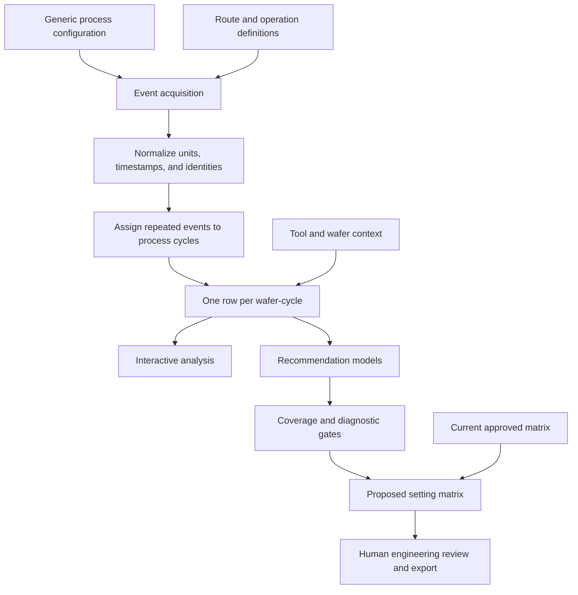
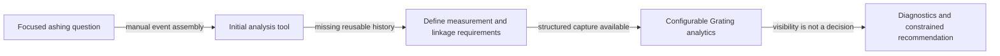

# Grating Process Analytics

**Role in portfolio:** domain engineering plus analytical software

**Public implementation:** architecture and evolution case study

**Evidence status:** reconstructed from verified implementation; no private code or process rules

## Problem

A process recommendation may depend on measurements collected at several
operations, tool context, wafer attributes, repeated processing, and the currently
approved setting matrix. The records arrive as events, not as the one-row-per-wafer
analytical frame needed for comparison or modeling.

The hard problem is not plotting. It is reconstructing which event belongs to
which process cycle, preserving traceability, showing data quality, and ensuring a
model recommendation remains advisory rather than silently becoming a process
change.

## What Made This More Than a Dashboard Project

This work began with a physical process question, not a request for an analytics
screen. The focused Ashing analysis required upstream measurements, process inputs,
downstream responses, equipment context, and wafer identity to be connected in the
order they occurred. Building that first analysis exposed that some of those
relationships were not structured well enough for repeatable engineering use.

That moved part of the project upstream. I had to determine which measurements and
events mattered, what identity and process-cycle relationships were required, and
what history the application needed. I defined those requirements with the relevant
manufacturing-system and data owners. Once structured history was available, the
software could evolve from a focused analysis into configurable Grating analytics
and constrained recommendation support.

The audited checkout verifies the mature data requirements in the analytical
engine and recommendation modules, but it does not preserve enough of the earliest
tool or upstream-system history to assign exact dates or claim implementation work
performed by other system owners.

## First solution

The first useful workflow answered a focused process question: retrieve the
relevant measurements, align them by wafer, compare response behavior, and propose
an ashing setting for engineering review. A narrow application helped replace
manual joins and spreadsheet repetition.

## Limitation

Hard-coded measurement choices and a single response path did not generalize.
Repeated entries at an operation could pair the wrong upstream and downstream
events. A recommendation without coverage, residual, extrapolation, and sample
diagnostics was too easy to over-trust. Re-querying the source for each browser
interaction also mixed expensive data acquisition with inexpensive analysis.

## Iteration

The application evolved into a configuration-driven analytics engine:

1. A process catalog and route definition identify eligible operations.
2. Configuration selects measurement roles without embedding them in chart code.
3. Event history is normalized and assigned to explicit process cycles.
4. Tool assignments and wafer attributes are joined at the correct grain.
5. A wafer-level frame supports trends, distributions, correlations, and journey
   inspection.
6. A recommendation module fits candidate models and reports diagnostics.
7. A snapshot store separates shared source refresh from browser-specific filters,
   exclusions, and downloads.

## Next problem

Once the recommendation became reusable, governance mattered more than another
model. Engineers needed to distinguish observed from extrapolated regions, compare
current and proposed matrices, exclude known-invalid wafers without mutating the
shared snapshot, and export the evidence behind a proposal.

## Mature state

## Evolution

The current implementation verifies the mature analytical and recommendation
stages. The earliest tool is not present in enough historical detail to publish a
version-by-version reconstruction, so this diagram deliberately avoids dates,
interfaces, and claims about who implemented upstream data-system changes.

## Selected Engineering Challenges

### Challenge: Raw events were not one analytical observation

**What was happening**

A wafer could enter the same operation more than once because of re-entry, rework,
or repeated measurement. The source history therefore contained several plausible
upstream and downstream events for one wafer.

**Why the earlier approach became insufficient**

Collapsing everything to one row per wafer could pair a later response with an
earlier process input. Treating every event as independent could create the opposite
error: false cycles that never represented one physical processing sequence.

**Engineering change**

I normalized the event order and assigned repeated entries to explicit process
cycles. The analytical row became one wafer-cycle, with measurements, settings,
responses, and tool context joined to that cycle rather than to wafer identity
alone.

**Why it worked**

The model and charts compared observations that belonged to the same physical
process pass while retaining legitimate rework history.

**Software concept**

This is event reconstruction at an explicit analytical grain using a composite
identity.

### Challenge: The required history was not structured for repeatable analysis

**What was happening**

The focused analysis depended on measurement roles and historical relationships
that could be assembled manually but were not consistently available as a reusable
application input.

**Why the earlier approach became insufficient**

A script could not make an absent relationship reliable. Continuing to repair the
history inside each analysis would preserve ambiguity and make results difficult to
reproduce.

**Engineering change**

I defined the required measurements, process events, identities, and linkages with
the relevant manufacturing-system and data owners. The application then treated
those structured relationships as explicit inputs and validated its configuration
before constructing the wafer-cycle dataset.

**Why it worked**

The broader application no longer depended on a one-time manual interpretation of
the history. The physical-process requirement became a repeatable system input.

**Software concept**

This is requirements engineering, a data contract, and manufacturing-system
integration.

### Challenge: A mathematically valid recommendation could still be unsafe

**What was happening**

A fitted relationship could produce a numerical setting even when the supporting
sample was small, the target lay outside observed coverage, residual behavior was
poor, different process families behaved differently, or invalid wafers distorted
the fit.

**Why the earlier approach became insufficient**

A recommendation value without its evidence made a calculation look more certain
than the manufacturing history justified.

**Engineering change**

I separated analysis by the relevant process grouping, exposed sample and fit
diagnostics, checked coverage and extrapolation, made wafer exclusions reversible
and session-scoped, compared current and proposed settings, and kept final approval
with the engineer.

**Why it worked**

The application presented a reviewable proposal and the reasons to distrust it. It
did not turn a model result into an uncontrolled equipment change.

**Software concept**

This is model validation with guardrails and a human-in-the-loop decision boundary.

The shared snapshot is refreshed independently of browser sessions. A session can
select or exclude fictional wafers, change views, and produce an export without
changing the source snapshot used by another session. If a refresh fails, the
prior valid snapshot remains available with an updated status.

### Illustrative analytical grain

The following fields are generic and fictional. They explain the grain; they are
not production schema names or values.

| wafer_key | process_cycle | upstream_measurement | recipe_setting | downstream_response | tool_family |
|---|---:|---:|---:|---:|---|
| SYN-W001 | 1 | 1.04 | 42 | 0.97 | TOOL-A |
| SYN-W002 | 1 | 1.08 | 44 | 1.01 | TOOL-B |
| SYN-W001 | 2 | 1.01 | 41 | 0.96 | TOOL-A |

The composite key is wafer plus process cycle. Collapsing this table to wafer only
would lose a legitimate rework/re-entry event; treating every raw event as a new
cycle would create false pairings.

## Result

The mature design turns a recommendation into an auditable chain:
configuration → source events → cycle assignment → wafer-level evidence → model
diagnostics → proposed matrix → human decision. Shared acquisition is reused,
while interactive work remains isolated per session.

The portfolio does not claim that the software autonomously controlled equipment
or improved a specific process metric. Its verified contribution is decision
support: making evidence assembly repeatable and the limitations of a proposal
visible.

## Lessons

- Event pairing and analytical grain are process-engineering decisions, not data
  cleanup details.
- Re-entry and rework must be modeled explicitly before fitting a relationship.
- Configuration should describe measurement roles; visualization code should not
  encode private route knowledge.
- A recommendation requires diagnostics, coverage checks, and a review boundary.
- Shared snapshots and isolated session state solve different concurrency problems.
- Exclusion is safest when it is reversible, visible, and scoped to the analysis.

## Personal ownership

| Personally designed and implemented | Defined or coordinated | Implemented/owned outside the application |
|---|---|---|
| Python/pandas analytical engine, configurable measurement mapping, repeated-event reconstruction, interactive analysis workflow, recommendation and diagnostics layer, current-versus-proposed comparison, snapshot/session behavior, and portal-ready delivery | Measurement roles, required historical relationships, data-quality expectations, and the evidence needed for engineering review | Upstream manufacturing-system capture, database administration, approved settings, equipment operation, and final authorization of a process change |

## Tradeoffs

- **Case study instead of a clone:** preserves the substantive engineering story
  without publishing disguised process rules; readers cannot run this story yet.
- **Configurable roles:** support multiple analyses but require validation and clear
  error messages when a configuration is incomplete.
- **Simple interpretable models:** are easier to diagnose and defend; they may miss
  nonlinear behavior and interactions.
- **Human approval boundary:** prevents an analytical result from becoming an
  uncontrolled process change, at the cost of additional workflow.
