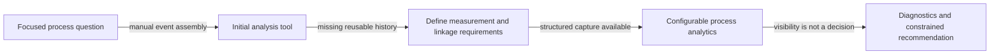
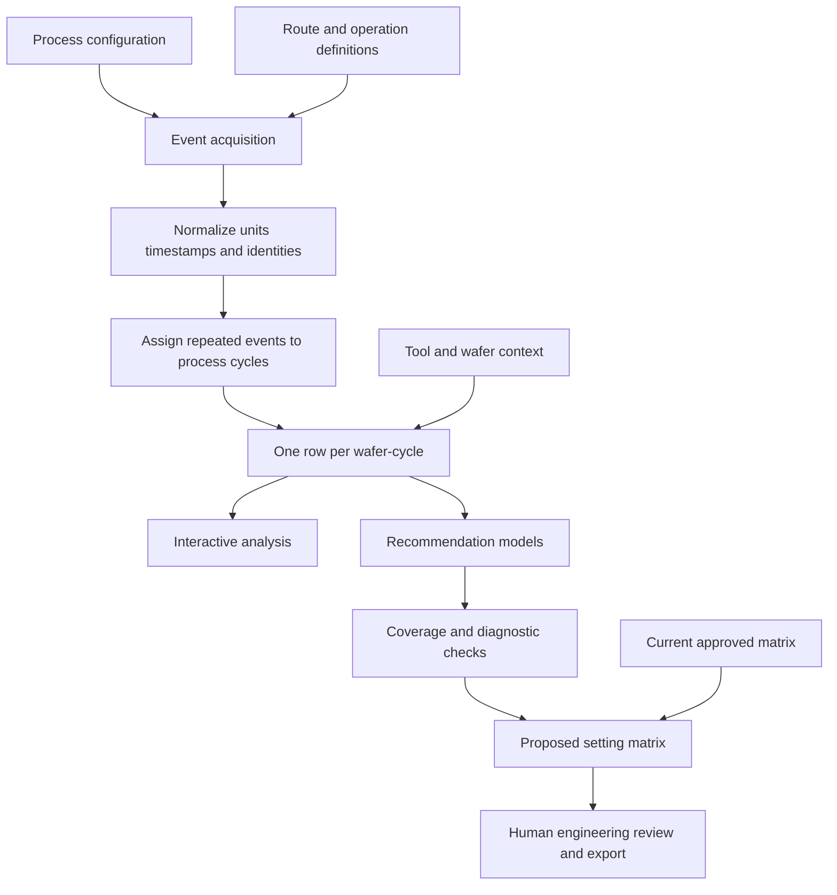

# Grating Process Analytics

**What I built:** A process analytics and recommendation workflow that reconstructs wafer history across repeated process events, connects upstream conditions to downstream results, and presents model diagnostics for engineering review.

**What it demonstrates:** Semiconductor process engineering, data requirements, event reconstruction, configurable analytics, statistical modeling, human-in-the-loop decision support, and manufacturing-system integration.

## Problem

A process recommendation can depend on measurements collected at several operations, tool context, wafer attributes, repeated processing, and the currently approved setting matrix. The source history arrives as events, not as the one-row-per-observation analytical frame needed for comparison or modeling.

The challenge is therefore not simply visualization. The application has to determine which measurements belong to the same physical process cycle, preserve traceability, expose data quality, and prevent a mathematical recommendation from being mistaken for an automatic process decision.

## How the project started

This work began with a physical process question rather than a request for a dashboard. The initial ashing analysis needed upstream measurements, process inputs, downstream responses, equipment context, and wafer identity to be connected in the order they occurred.

Building that first analysis exposed a more fundamental issue: some of the relationships required for repeatable engineering analysis were not yet structured cleanly enough in the available history. I defined the measurements, event relationships, identities, and process-cycle history the application needed and worked with the relevant manufacturing-system and data owners to establish those requirements.

Once that structured history was available, the software evolved from a focused analysis into a reusable, configuration-driven analytics and recommendation workflow.

## Evolution

## Architecture

The shared source history is normalized and reconstructed into an explicit wafer-cycle grain before it reaches the modeling layer. Browser sessions can then filter, exclude, compare, and export from a stable analytical snapshot without mutating the shared source state.

## Selected engineering challenges

### Reconstructing the correct process cycle

A wafer can enter the same operation more than once because of re-entry, rework, or repeated measurement. That means several upstream and downstream events may be plausible matches for one wafer.

Collapsing everything to one row per wafer can pair a later response with an earlier process input. Treating every event as independent can create the opposite problem: false cycles that never represented one physical processing sequence.

I normalized event order and assigned repeated entries to explicit process cycles. The analytical row became one wafer-cycle, with measurements, settings, responses, and tool context joined to that cycle rather than to wafer identity alone.

**Engineering concepts:** event reconstruction, composite identity, explicit analytical grain, rework handling.

### Turning a one-time manual relationship into a data requirement

The focused analysis depended on historical relationships that could be assembled manually but were not consistently available as reusable application inputs.

Rather than burying that ambiguity inside more Python logic, I defined the required measurements, process events, identities, and linkages with the relevant manufacturing-system and data owners. The application then treated those relationships as explicit inputs and validated its configuration before constructing the wafer-cycle dataset.

**Engineering concepts:** requirements engineering, data contracts, manufacturing-system integration, source-data quality.

### Keeping recommendations interpretable and bounded

A model can produce a numerical answer even when the supporting sample is small, the target is outside observed coverage, residual behavior is poor, or different process families behave differently.

I separated analysis by the relevant process grouping, exposed sample and fit diagnostics, checked coverage and extrapolation, made wafer exclusions reversible and session-scoped, compared current and proposed settings, and kept final approval with the engineer.

The application therefore presents a reviewable proposal together with the reasons to trust or distrust it. It does not convert a fitted relationship into an uncontrolled equipment change.

**Engineering concepts:** model diagnostics, extrapolation controls, guardrails, human-in-the-loop decision support.

### Separating shared data acquisition from interactive analysis

Repeated source queries made every browser interaction pay for the same data acquisition work. At the same time, different engineers needed to explore different subsets and exclusions without changing one another's view.

I separated the shared refresh lifecycle from session-level analysis. A validated snapshot is refreshed independently, while each browser session can filter, exclude, compare, and export without mutating the common dataset. If refresh fails, the prior valid snapshot remains available with updated status.

**Engineering concepts:** snapshot architecture, multi-user isolation, caching, last-known-good state.

## Example analytical grain

The public example below is generic and fictional, but it illustrates the important data-model decision.

| wafer_key | process_cycle | upstream_measurement | recipe_setting | downstream_response | tool_family |
|---|---:|---:|---:|---:|---|
| SYN-W001 | 1 | 1.04 | 42 | 0.97 | TOOL-A |
| SYN-W002 | 1 | 1.08 | 44 | 1.01 | TOOL-B |
| SYN-W001 | 2 | 1.01 | 41 | 0.96 | TOOL-A |

The composite key is wafer plus process cycle. Collapsing the table to wafer only would lose legitimate rework/re-entry history; treating each raw event as its own cycle would create false pairings.

## Result

The mature workflow turns a process recommendation into a traceable engineering chain:

`configuration → source events → process-cycle reconstruction → wafer-level evidence → model diagnostics → proposed setting → human decision`

The value is not that software replaces the process engineer. The value is that evidence assembly, event pairing, diagnostics, and comparison become repeatable and reviewable instead of depending on one-off manual joins and spreadsheet interpretation.

## My ownership

I designed and implemented the Python/pandas analytical engine, configurable measurement mapping, repeated-event reconstruction, interactive analysis workflow, recommendation and diagnostics layer, current-versus-proposed comparison, snapshot/session behavior, and portal-ready application delivery.

I also defined the measurement roles, historical relationships, data-quality expectations, and evidence the application required in coordination with manufacturing-system and data owners. Upstream manufacturing-system capture, database administration, approved process settings, equipment operation, and final process authorization remained with their respective owners.

## Tradeoffs

- **Configuration-driven measurement roles:** make the application reusable across related analyses, but require validation and clear errors when configuration is incomplete.
- **Interpretable models:** are easier to diagnose and defend in an engineering review, but may miss nonlinear effects or interactions.
- **Human approval boundary:** keeps recommendations controlled, but intentionally adds review rather than maximizing automation.
- **Shared snapshots plus session-local analysis:** reduce repeated source work and protect multi-user isolation, but require explicit refresh and cache lifecycle management.

## Confidentiality

Private process rules, source schema names, equipment identifiers, approved production settings, and employer data are not included. The public case study preserves the engineering architecture, reasoning, and ownership boundaries using generic terminology and fictional examples.
