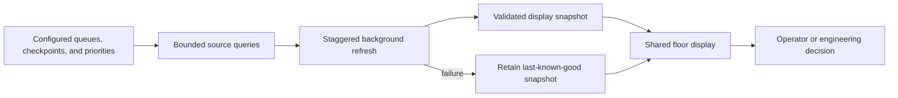
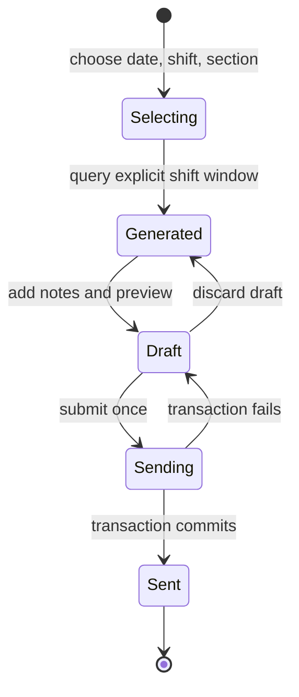
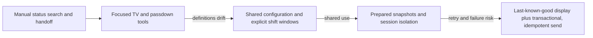

# Lean Digital Operations

**Role in portfolio:** manufacturing workflow and information-flow engineering

**Public implementation:** combined Fab TV and shift-passdown case study

**Evidence status:** reconstructed from verified applications; no private queues, rules, or recipients

## Problem

Manufacturing teams need two different kinds of operational awareness. During a
shift, people need a low-friction view of what should move next and why. At shift
change, they need a durable summary of what happened, what remains at risk, and
where attention is required.

Without purpose-built workflows, information is repeatedly searched, copied,
reformatted, and explained. The waste is information motion: walking to a screen,
opening several reports, reconstructing priority, and manually assembling a
handoff whose time boundary may be ambiguous.

## First solution

Two focused tools addressed the immediate needs:

- **Fab TV:** a continuously visible browser dashboard grouped work into operational
  queues and displayed progress toward configured checkpoints.
- **Passdown:** a date-and-shift workflow assembled events, comments, and current
  work-in-process into an editable email preview.

Both moved the decision closer to the work instead of asking users to become data
analysts for routine coordination.

## Limitation

Early local logic could drift from shared process definitions. Refreshing every
view independently increased database load. A passdown assembled only in one
desktop session did not translate cleanly to multiple browser users, and a send
action needed protection from duplicate submissions. For TV displays, blocking on
a refresh or clearing the view on failure was worse than showing slightly stale,
clearly labeled data.

## Iteration

The TV workflow moved queue membership, checkpoints, timing intervals, and priority
ordering into configuration. Background workers refreshed one logical area at a
time, cached completed display frames, and retained prior data on failure. Browser
polling became lightweight: it requested already prepared state rather than
triggering a source query.

The passdown workflow formalized shift windows, retained local date/shift/section
filters, added editable preview and discard/send states, bounded server-side session
caches, reused current-WIP snapshots, queued recipients in batches, wrapped queue
writes in transactions, and protected against duplicate submission.

## Next problem

The next challenge was shared ownership. Operational rules change; browser sessions
overlap; and a delivery action crosses an external system boundary. The applications
needed explicit configuration authority, isolated session state, observable refresh
status, and idempotent state transitions rather than hidden assumptions.

## Mature state

### Ambient work visibility

### Durable shift handoff

These are complementary Lean controls. TV is a pull signal for current attention;
passdown is a standard-work artifact across a temporal boundary.

## Evolution

## Selected Engineering Challenges

### Challenge: Users repeatedly reconstructed current status

**What was happening**

The same production state had to be gathered and interpreted repeatedly before a
team could decide what needed attention next.

**Why the earlier approach became insufficient**

The information existed, but repeated searching and individual interpretation made
visual management dependent on who assembled the view and when they last checked.

**Engineering change**

Fab TV moved queue membership, checkpoints, timing, and priority rules into shared
configuration. One background process refreshes prepared display state in staggered
cycles; the screen polls that completed state and retains the prior view if refresh
fails.

**Why it worked**

The operational screen became common standard work instead of a fresh research task
for every user. Expensive retrieval was separated from lightweight display updates.

**Software concept**

This is background preparation, configuration-driven behavior, caching, and
last-known-good state applied to Lean visual management.

### Challenge: Shift boundaries had to mean the same thing every time

**What was happening**

A passdown selected by calendar date alone could include the wrong events around a
Day/Night boundary, especially when the user moved between dates or sections.

**Why the earlier approach became insufficient**

An editable message could look correct while its underlying population used an
inconsistent time window. Re-querying after every local filter change also repeated
source work without changing the selected shift.

**Engineering change**

I formalized date-and-shift window functions, loaded the selected production
population once, and applied section and shift presentation filters locally. The UI
shows both the loaded window and the currently selected view before preview.

**Why it worked**

The handoff population follows one reusable boundary rule, while users can refine
the message without silently changing or reloading its source window.

**Software concept**

This is domain-rule centralization, temporal boundary modeling, and reuse of a
session-scoped dataset.

### Challenge: A repeated send could create duplicate external actions

**What was happening**

A browser retry, double click, or uncertain response could submit the same passdown
more than once to an external database-backed delivery queue.

**Why the earlier approach became insufficient**

Disabling a button in the browser was not enough protection because the server and
database still had to handle a repeated request safely.

**Engineering change**

I assigned the draft a submission identity, protected against repeated submission,
deduplicated recipients, wrote bounded recipient batches inside one transaction,
committed only after all inserts succeeded, and rolled back on error.

**Why it worked**

The send state became an explicit server-side transition. Partial recipient writes
were not accepted as a successful passdown, and a repeated action could be
recognized rather than blindly replayed.

**Software concept**

This is idempotency protection plus transactional integrity around an external
side effect.

## Result

The software makes the operational question explicit: what needs attention now,
what evidence defines that priority, and what state must survive the shift boundary?
Configuration reduces code edits when operational definitions change. Prepared
snapshots reduce repeated source work. Transaction and duplicate-submit controls
make the external delivery action safer.

No quantified labor or cycle-time savings are claimed. The architectural result is
a reduction in avoidable information reconstruction and clearer ownership of
refresh, handoff, and send state.

## Lessons

- Start with information flow and standard work, not dashboard aesthetics.
- Shift boundaries are domain rules and should be testable functions.
- A wall display must fail gracefully; blank is often less useful than labeled stale data.
- Configuration ownership needs validation and a documented fallback policy.
- Browser-local state, server cache state, database queue state, and email delivery
  state are distinct and should not be conflated.
- Idempotency matters whenever a user can retry an action with external effects.

## Personal ownership

| Personally designed and implemented | Existing dependency or context |
|---|---|
| Queue/checkpoint presentation, configuration-driven prioritization, background refresh and display caching, shift-window and filtering workflow, editable preview, server session cache, transactional queue submission, duplicate protection, and portal integration | Manufacturing priority decisions, staffing and shift policy, source records, display hardware, database email queue infrastructure, and recipient ownership |

## Tradeoffs

- **Shared configuration:** improves consistency but creates a governed operational
  dependency whose changes require validation.
- **Polling prepared state:** is simple and robust for floor displays; streaming
  could reduce latency but adds connection and recovery complexity.
- **In-process session cache:** limits browser payloads and protects large frames;
  it requires bounds and would need a shared store for multiple service instances.
- **Email as a handoff channel:** fits an existing workflow but is less queryable
  than a dedicated event log or collaboration system.
