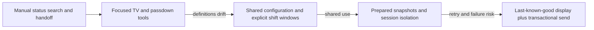
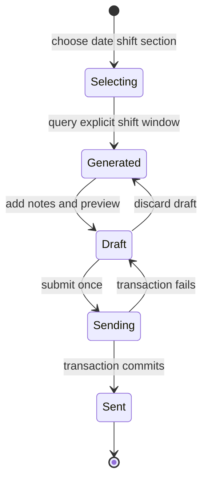

# Lean Digital Operations

**What I built:** Shared production-visibility and shift-handoff tools that reduce repeated manual status reconstruction and turn common manufacturing coordination tasks into explicit digital workflows.

**What it demonstrates:** Lean workflow design, configuration-driven applications, background refresh, multi-user state management, transactional actions, idempotency, and operational reliability.

## Problem

Manufacturing teams need two different kinds of operational awareness. During a shift, people need a low-friction view of what should move next and why. At shift change, they need a durable summary of what happened, what remains at risk, and where attention is required.

Without purpose-built workflows, the same information is repeatedly searched, copied, reformatted, and explained. The waste is information motion: opening several reports, reconstructing priorities, walking to status screens, and manually assembling a handoff whose time boundary may be ambiguous.

## What I built

Two focused applications addressed those needs:

- **Fab TV:** a continuously visible browser dashboard that groups production work into operational queues and shows progress toward configured checkpoints.
- **Passdown:** a date-and-shift workflow that assembles events, comments, and current work-in-process into an editable handoff preview before submission.

Both applications move the decision closer to the work. Instead of asking every user to become a data analyst for routine coordination, the systems prepare the relevant state and make the operating rules visible.

## Evolution

As the tools gained shared use, the problems changed. Operational definitions had to be consistent across users, browser refresh could not repeatedly trigger expensive source queries, shift boundaries had to be explicit, and external actions such as passdown submission needed protection from duplicate or partial writes.

## Architecture

### Ambient production visibility

### Controlled shift handoff

Fab TV acts as a pull signal for current attention. Passdown provides durable standard work across a time boundary.

## Selected engineering challenges

### Making production status reusable instead of repeatedly reconstructed

The same production state had to be gathered and interpreted repeatedly before a team could decide what needed attention next. The information existed, but the workflow depended on who assembled the view and when they last checked it.

I moved queue membership, checkpoints, timing intervals, and priority ordering into shared configuration. A background process refreshes prepared display state in staggered cycles, while the browser polls the completed state instead of triggering a new source query. If refresh fails, the previous valid view stays available and can be labeled stale rather than disappearing.

**Engineering concepts:** Lean visual management, configuration-driven behavior, background preparation, caching, last-known-good state.

### Defining shift boundaries as code rather than interpretation

A handoff selected only by calendar date can include the wrong events around a day/night boundary. The risk is especially subtle because the resulting message may still look reasonable.

I formalized date-and-shift window functions, loaded the selected production population once, and applied section and presentation filters locally. The workflow keeps the loaded time window explicit while allowing users to refine the handoff without silently changing its source population.

**Engineering concepts:** temporal boundary modeling, domain-rule centralization, reusable session datasets.

### Protecting external actions from retries and double submissions

A browser retry, double click, or uncertain response can submit the same passdown more than once. Disabling a button in the browser is not enough because the server and database still need to handle a repeated request safely.

I assigned each draft a submission identity, protected against repeated submission, deduplicated recipients, wrote recipient batches inside one transaction, committed only after all inserts succeeded, and rolled back on error.

**Engineering concepts:** idempotency, transactional integrity, retry safety, explicit state transitions.

### Separating shared state from user-specific state

A shared manufacturing snapshot should not be rebuilt every time one user changes a filter, and one user's edits or selections should not alter another user's workflow.

I separated common refreshed state from browser/session-level choices. Shared source work is prepared once, while user-specific filters, draft content, and submission state remain isolated.

**Engineering concepts:** shared cache versus session state, multi-user isolation, state ownership.

## Result

The applications reduce avoidable information reconstruction by turning recurring manufacturing coordination into prepared, explicit workflows. Production visibility is refreshed once and reused, shift windows follow one defined rule, and external submission actions have controlled server-side state transitions rather than relying on browser behavior alone.

The larger engineering lesson is that digital Lean work is not primarily about adding charts. It is about making information flow, standard work, ownership, and failure behavior explicit in the software.

## My ownership

I designed and implemented the queue/checkpoint presentation, configuration-driven prioritization, background refresh and display caching, shift-window and filtering workflow, editable preview, server-side session behavior, transactional queue submission, duplicate protection, and portal integration.

Manufacturing priority decisions, staffing and shift policy, source records, display hardware, database email-queue infrastructure, and recipient ownership remained with their respective process and system owners.

## Tradeoffs

- **Shared configuration:** improves consistency but creates an operational dependency whose changes require validation.
- **Polling prepared state:** is simple and robust for floor displays, while streaming would reduce latency at the cost of more connection and recovery complexity.
- **In-process session state:** protects large datasets and keeps user choices isolated, but a multi-process deployment would need a shared session store.
- **Email-based handoff:** fits an established workflow but is less queryable than a dedicated collaboration or event system.

## Confidentiality

This case study uses generic workflow terminology and excludes private production queues, recipient lists, operating rules, database objects, and employer data. The architecture and engineering decisions reflect the work I personally designed and implemented.
