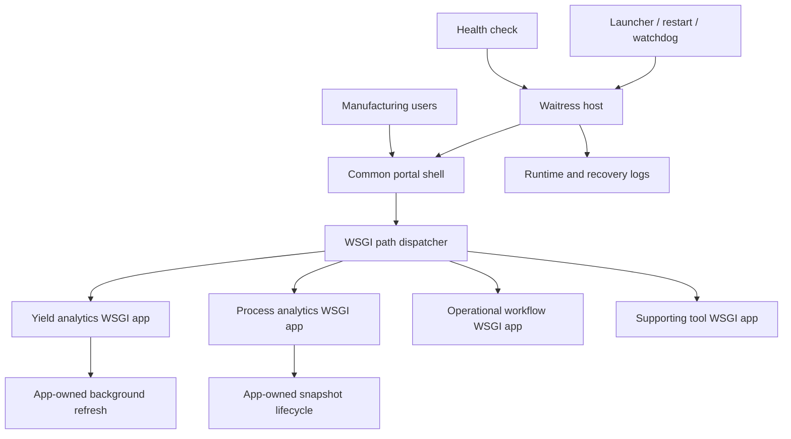
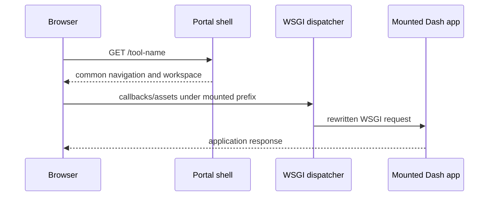

# Manufacturing Application Platform

**Role in portfolio:** application delivery, integration, and operational support

**Public implementation:** architecture and evolution case study

**Evidence status:** reconstructed from verified server, archive, launcher, and history evidence

## Problem

Useful manufacturing tools often begin as individual desktop scripts or locally
hosted dashboards. That is appropriate for discovering the problem, but it does
not answer long-term delivery questions: Where do users find applications? Which
process owns the server? How are routes isolated? What happens when one app fails
to import? How is health checked, logged, restarted, and supported?

The platform problem emerged from application success. More tools and users made
the cost of separate ports, inconsistent launch instructions, duplicated runtime
logic, and manual recovery visible.

## First solution

Each tool initially owned its own window or development server. Versioned local
packages made delivery possible, and launcher scripts reduced setup knowledge.
This was a pragmatic way to validate user value before investing in shared
infrastructure.

## Limitation

Independent processes created a fragmented entry point and repeated hosting code.
Development servers were not an operational hosting model. Applications made
different assumptions about URL roots and startup behavior, so mounting them under
one service required more than linking to another port. Restarting a process without
a health signal also made support reactive.

## Iteration

The system evolved in small, reversible steps:

1. A common portal shell provided navigation and application status.
2. Dash applications exposed their underlying WSGI servers instead of starting
   their own listeners when imported.
3. A dispatcher mounted each application under a stable path while preserving
   query strings and application-specific asset/callback prefixes.
4. Waitress became the shared production-style Windows WSGI host.
5. A health endpoint enabled scripted checks.
6. Launcher, restart, status, and watchdog scripts added logs and repeatable recovery.
7. Application imports were isolated so one mount failure could be reported without
   preventing every healthy application from starting.

## Next problem

A single service simplifies discovery but increases blast radius. Startup work,
background threads, mutable module globals, and route-prefix assumptions can collide
inside one process. The engineering focus therefore shifted to explicit application
factories, idempotent background-service startup, bounded caches, import error
reporting, and consistent runtime configuration.

## Mature state

### Request routing

## Evolution

## Selected Engineering Challenges

### Challenge: Other engineers needed applications built for one workstation

**What was happening**

Useful engineering tools began on a local workstation, then other engineers needed
the same behavior and data interpretation.

**Why the earlier approach became insufficient**

Copying an application made access possible but created multiple installed versions
and made every update a coordination problem. Versioned application bundles improved
repeatability but did not remove synchronization or discovery friction.

**Engineering change**

I first made releases repeatable and versioned, then moved the shared browser
applications behind a common portal and central server. The migration remained
incremental so a working application did not have to be rewritten merely to join
the portal.

**Why it worked**

Users received one discoverable entry point and centrally maintained application
state, while the delivery mechanism could evolve independently of each tool's
manufacturing logic.

**Software concept**

This is software distribution and release management evolving into centralized
client/server hosting.

### Challenge: Applications assumed they owned their listener

**What was happening**

Standalone Dash applications were written to start their own server, background
services, route roots, and browser window. Those assumptions conflicted when several
applications had to share one host and one navigation surface.

**Why the earlier approach became insufficient**

Importing a standalone module could start duplicate work or bind another listener.
Callbacks and assets could also point at the wrong URL when an application moved
under a portal prefix.

**Engineering change**

I separated application construction from process startup, exposed each Dash
application's WSGI server, made background startup explicit and repeatable, assigned
mounted callback/asset prefixes, and dispatched stable portal paths to the mounted
applications.

**Why it worked**

The portal owned the listener and process lifecycle; each application owned its
domain behavior. Multiple tools could share one Waitress host without pretending
they still ran at the root of separate servers.

**Software concept**

This is WSGI composition with application factories, route-prefix management, and
dependency/lifecycle separation.

### Challenge: The enterprise environment was part of delivery

**What was happening**

Code that worked locally still depended on a provisioned Windows host, database
access, internal connectivity, allowed application ports, persistent execution,
shared resources, and recovery after reboot.

**Why the earlier approach became insufficient**

Those constraints crossed application, network, security, and infrastructure
ownership. They could not be solved by adding another Python function or by assuming
local administrator behavior represented the shared environment.

**Engineering change**

I identified and troubleshot the application's concrete requirements and worked
with IT on host, domain/security-policy, database-access, connectivity, internal
access, and restart constraints. The application side used configurable paths and
ports rather than publishing environment-specific values.

**Why it worked**

Each team could act on a defined boundary: I owned and diagnosed application
requirements; IT retained ownership of enterprise network, domain, firewall, and
server administration.

**Software concept**

This is systems integration and forward-deployed engineering across an explicit
infrastructure ownership boundary.

### Challenge: Running a script was not an operational support model

**What was happening**

A shared service could stop after an exception, host restart, or lost terminal
session. Without a health signal, support began only after a user reported that a
page was unavailable.

**Why the earlier approach became insufficient**

A process existing did not prove the portal could answer requests, and a manual
command known only to the developer did not provide repeatable recovery.

**Engineering change**

I added a portal health endpoint, operational logs, deterministic launcher and
restart commands, status checks, and a watchdog path that could detect a failed
health check and reissue the launcher. Mounted application failures are recorded so
one import problem does not hide the state of healthy applications.

**Why it worked**

The shared service gained a testable health contract and a documented recovery path
that did not depend on reconstructing the original development session.

**Software concept**

This is observability, health checking, fault isolation, recovery automation, and
operational ownership.

The public case study intentionally stops at this verified service model. It does
not claim a container platform, cloud deployment, enterprise identity system,
zero-downtime release process, or a particular package registry because those
capabilities were not established by the audited evidence.

## Result

The mature system provides one discoverable surface and one operational server
contract while allowing each application to retain its own domain logic and refresh
lifecycle. Health, logs, deterministic launch, and restart behavior make the service
supportable by someone other than the original terminal session.

The result is best understood as field engineering: integrating software with a
Windows-hosted manufacturing environment, evolving delivery around real usage, and
making failure recovery part of the design.

## Enterprise integration boundary

Running applications in a manufacturing environment required coordination with IT
around a Windows host, database connectivity and access, internal routing/ports,
security policy, persistent execution, shared resources, and reboot recovery. My
role was to define and troubleshoot the application requirements and work with IT
to resolve those constraints. I do not claim enterprise network, domain, firewall,
or server administration.

## Lessons

- A portal is not a platform until hosting, routing, health, and recovery are explicit.
- Dash callback and asset prefixes must be designed for mounted deployment.
- Imported applications must not start servers or duplicate background workers.
- One process is operationally simple but creates shared-resource and blast-radius risks.
- Health checks should prove a defined service contract, not merely that a process exists.
- Archived failed packages can be valuable engineering evidence when they explain why
  integration and release checks became stricter.

## Personal ownership

| Personally designed and implemented | Existing dependency or context |
|---|---|
| Portal shell, application registry and mounting pattern, route-prefix integration, Waitress hosting, health endpoint, launcher/restart/watch behavior, integration hardening, and incremental migration of applications into the shared service | Windows host administration, network and security policy, source databases, user devices, and enterprise infrastructure outside the application process |

## Tradeoffs

- **Single WSGI process:** lowers operational overhead and provides one entry point;
  a faulty or memory-heavy application can affect siblings.
- **Incremental mounting:** preserves working tools and validates each integration;
  temporary mixed desktop/web delivery remains during migration.
- **Scripted Windows operations:** match the verified environment and are transparent;
  a formal service manager or orchestrator would provide stronger lifecycle control.
- **Import isolation:** keeps healthy apps available when one mount fails, but the
  portal must make partial readiness observable.

## Sensible next evolution

Without pretending it already exists, a production expansion would add structured
central logs, per-application readiness checks, resource budgets, a shared cache for
multi-process operation, automated release verification, secrets management, and a
documented rollback mechanism.
