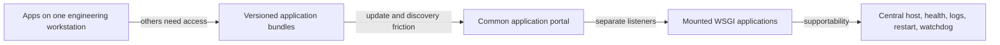
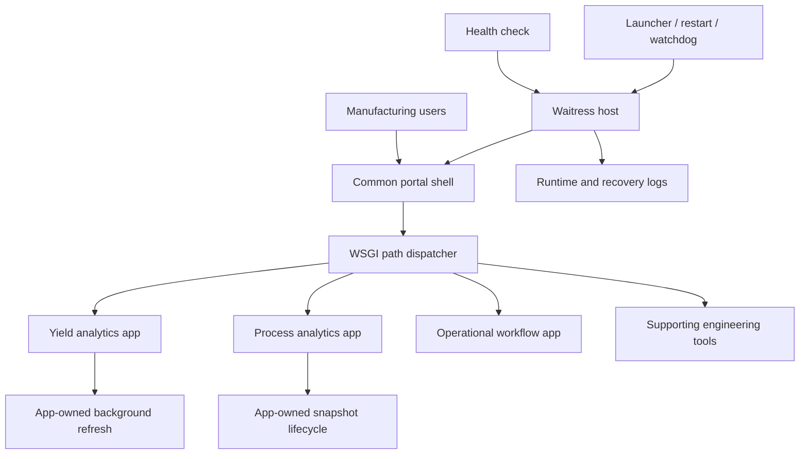
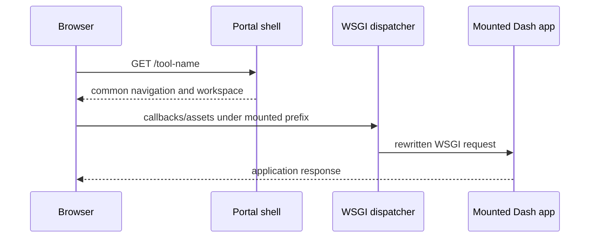

# Manufacturing Application Platform

**What I built:** The delivery and hosting layer that moved engineering applications from local Python tools and desktop packages into a centrally hosted, browser-accessible manufacturing software environment.

**What it demonstrates:** Forward-deployed engineering, application integration, Windows hosting, WSGI composition, deployment design, health and recovery tooling, and cross-functional troubleshooting with IT and database teams.

## Problem

Useful manufacturing tools often begin as individual scripts, desktop applications, or locally hosted dashboards. That is a good way to validate an engineering idea, but it creates a new problem once other users depend on the tool: where do they find it, how is it updated, who owns the running process, what happens after a reboot, and how is a failure diagnosed or recovered?

As the number of applications and users increased, separate ports, local copies, inconsistent launch instructions, duplicated hosting logic, and manual recovery became part of the engineering problem.

## How the platform evolved

I did not start by building a large platform. I evolved the delivery model as real usage exposed the next constraint.

The main steps were:

1. Make application releases repeatable and versioned.
2. Provide a common portal so users had one place to discover tools.
3. Refactor Dash applications so importing them did not automatically start their own listener or background work.
4. Expose each application's WSGI server and mount applications under stable portal paths.
5. Use Waitress as the shared Windows WSGI host.
6. Add a health endpoint, logging, deterministic launch/restart commands, status checks, and watchdog behavior.
7. Isolate application import failures so one broken mount did not prevent every healthy application from starting.

## Architecture

### Request routing

## Selected engineering challenges

### Moving applications beyond one workstation

The first tools were useful on a local engineering workstation, but other engineers eventually needed the same behavior and data interpretation. Copying applications to multiple machines solved access temporarily while creating version drift and update coordination.

I first made delivery repeatable through versioned bundles, then moved browser-based tools into a common portal and centralized host. The migration was incremental so a working application did not need a full rewrite simply to join the shared environment.

**Engineering concepts:** release management, software distribution, client/server delivery, incremental migration.

### Integrating applications that assumed they owned the process

Standalone Dash applications commonly assume they own their listener, route root, browser launch, and background services. Those assumptions conflict when multiple applications share one host.

I separated application construction from process startup, exposed each Dash application's WSGI server, made background-service startup explicit and idempotent, assigned mounted callback/asset prefixes, and dispatched stable portal paths to each application.

The result was a cleaner ownership model: the portal owns the listener and process lifecycle; each application owns its domain behavior and refresh lifecycle.

**Engineering concepts:** WSGI composition, application factories, route-prefix management, lifecycle separation.

### Treating the enterprise environment as part of the system

Code that worked locally still depended on a provisioned Windows host, SQL Server connectivity, internal network access, allowed ports, domain/security policy, shared resources, persistent execution, and recovery after reboot.

I identified and troubleshot the application's concrete requirements and worked with IT and database owners to resolve host, access, connectivity, policy, and restart constraints. On the application side, I kept environment-specific paths and ports configurable rather than hard-coding infrastructure details.

This work required diagnosing problems across application code, Windows behavior, database access, networking, deployment, and enterprise ownership boundaries rather than treating every failure as a software bug.

**Engineering concepts:** systems integration, forward-deployed engineering, dependency isolation, cross-functional technical troubleshooting.

### Turning a running script into a supportable service

A process can appear to be running while the application is unavailable. A shared service can also disappear after an exception, machine restart, or terminal-session loss.

I added a defined health endpoint, operational logs, deterministic launcher and restart commands, status checks, and watchdog logic that could detect a failed health check and reissue the launcher. Mounted application failures are recorded so the status of healthy applications remains visible.

**Engineering concepts:** observability, health contracts, fault isolation, recovery automation, operational ownership.

### Managing the blast radius of a shared host

Centralizing applications simplifies discovery and support, but shared process state introduces new risks. Startup work, background threads, mutable module globals, and route assumptions can collide inside one process.

I responded by making application creation and background startup explicit, bounding caches, isolating import errors, and pushing runtime configuration into defined interfaces. These constraints make application integration more predictable and reduce the chance that one tool's startup behavior silently affects another.

**Engineering concepts:** shared-process isolation, idempotency, bounded resources, defensive integration.

## Result

The mature environment provides a single discoverable entry point for multiple manufacturing applications and a common operational contract for how those applications are hosted, checked, logged, restarted, and supported.

The larger achievement was not simply putting Dash applications on a server. It was building the infrastructure and integration model required to move engineering software from "works on my machine" into something a broader organization could depend on.

That progression also changed how I approached application development. Deployment, network/database integration, startup behavior, refresh lifecycle, health, and recovery became first-class design concerns rather than tasks added after the application was finished.

## My ownership

I designed and implemented the portal shell, application registry and mounting pattern, route-prefix integration, Waitress hosting configuration, health endpoint, launcher/restart/watchdog behavior, integration hardening, and incremental migration of applications into the shared service. I also diagnosed application-side requirements and worked directly with IT and database teams to resolve enterprise-environment constraints.

Enterprise network administration, domain policy, firewall policy, underlying Windows host administration, source databases, and user-device administration remained with their respective infrastructure owners.

## Tradeoffs

- **Single WSGI process:** lowers operational overhead and creates one entry point, but a faulty or memory-heavy application can affect sibling applications.
- **Incremental migration:** preserves working tools and reduces change risk, but mixed delivery models remain during the transition.
- **Scripted Windows operations:** are transparent and fit the environment, while a formal service manager or orchestrator would provide stronger lifecycle control.
- **Import isolation:** keeps healthy applications available when one integration fails, but partial readiness must be observable.

## Next technical evolution

A larger deployment could extend this design with structured centralized logging, per-application readiness checks, resource budgets, a shared cache for multi-process operation, automated release verification, secrets management, rollback automation, and stronger service lifecycle management.

## Confidentiality

This case study describes the architecture and engineering decisions using generic infrastructure terminology. Private network names, server identifiers, credentials, database objects, application routes, and employer-specific operating details are intentionally excluded.
