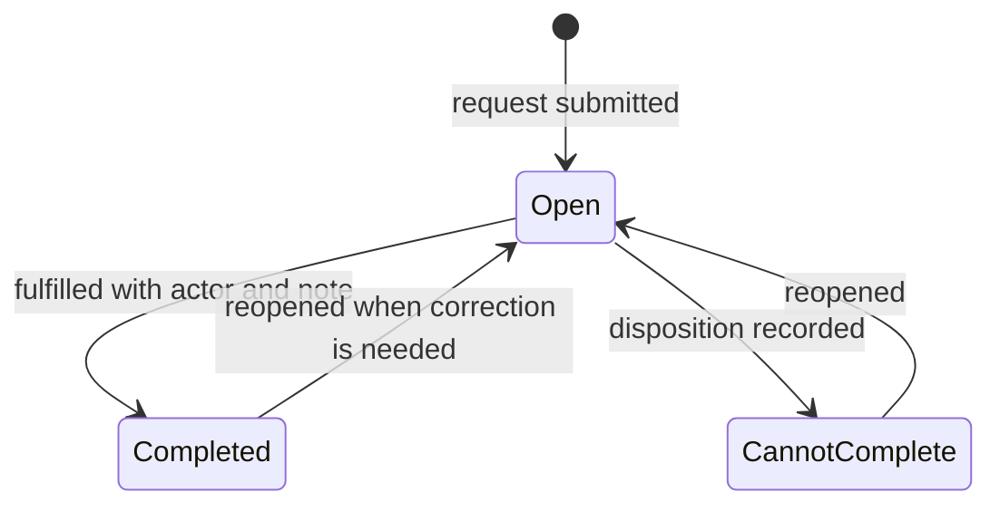

# Supporting Manufacturing Engineering Tools

These smaller applications show breadth without being inflated into flagship
projects. Every description is a clean-room capability summary based on verified
implementation evidence.

## Clean Room Request and Fulfillment Queue

### Problem

Requests for controlled-area garments or consumables need a clear submission path,
a visible fulfillment queue, and a record of completion or inability to complete.

### Engineering shape

- separate requester and fulfiller browser views
- local durable store behind a backend boundary
- periodic queue refresh and status filtering
- multi-select completion, cannot-complete, and reopen transitions
- fulfillment identity and comments captured with the transition
- configuration separated from the form and queue

The noteworthy lesson is that a form is only half a workflow. The receiving queue,
state transitions, correction path, and traceability determine whether the tool is
operationally complete.

## SPC and Process-Step Monitoring

This tool family converts selected process-step measurements into health summaries,
out-of-control/out-of-specification investigation, wafer cohort views, statistical
charts, review records, and exports. Configuration preserves which steps are
monitored; query and preparation functions are separated from desktop/browser
presentation.

The main design lesson is to distinguish a statistical signal from a disposition.
Software can calculate and prioritize signals, but an engineer must understand
limits, sampling, repeat measurements, and process context before acting.

## Current WIP and Process-Flow Views

Current work-in-process views reuse prepared snapshots to show flow distribution,
layer or wafer-size slices, and detail tables. A related chip-level view maps work
through ordered operations and surfaces stalled or overdue context. These tools
demonstrate that the same governed snapshot can support summary charts and detailed
operational views without every page issuing a new broad source query.

## Process-Run History Explorer

The process-run history pattern supports targeted investigation over cached history.
Refresh correction and store-level tests matter because a historical explorer can
look plausible while silently omitting late or corrected records. The design
therefore treats cache reconciliation as part of data correctness, not only
performance.

## Equipment Status

The equipment-status surface is a responsive, portal-mounted operational display.
Its portfolio value is integration discipline: adapting a useful status view to a
shared browser layout and common deployment contract rather than leaving it as an
isolated screen.

## Ownership boundary

I designed and implemented the application workflows, transformations,
visualizations, cache behavior, state transitions, and portal integrations described
above. Manufacturing definitions, source records, approvals, equipment operation,
and infrastructure policy remained with their respective process and system owners.
