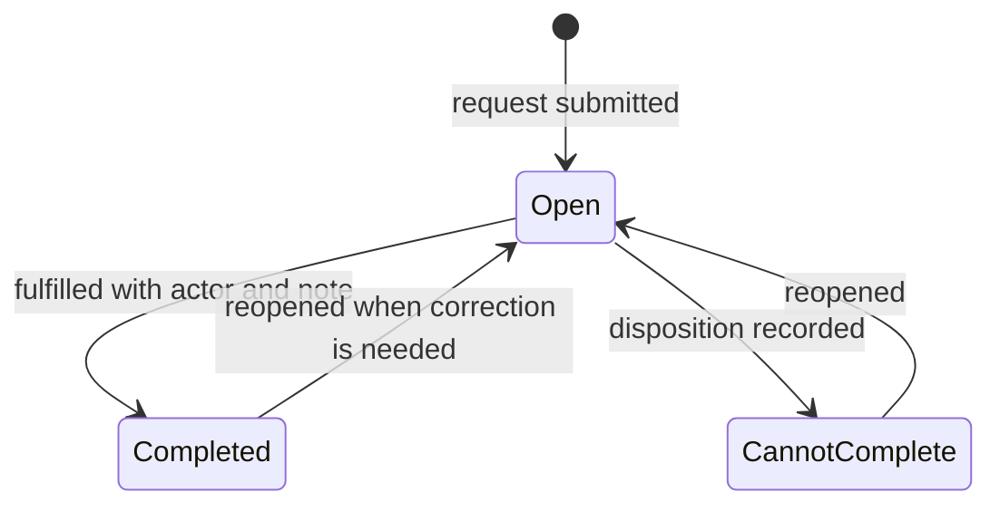

# Supporting Manufacturing Engineering Tools

These smaller applications show the breadth of manufacturing problems I have translated into working software. Each one targets a specific source of friction: request fulfillment, process monitoring, work-in-process visibility, historical investigation, or equipment status.

## Clean Room Request and Fulfillment Queue

### Problem

Requests for controlled-area garments or consumables need a clear submission path, a visible fulfillment queue, and a record of completion or inability to complete.

### What I built

- separate requester and fulfiller browser views
- a durable backend store behind the workflow boundary
- periodic queue refresh and status filtering
- multi-select completion, cannot-complete, and reopen transitions
- fulfillment identity and comments captured with each transition
- configuration separated from the form and queue logic

The key engineering lesson was that a form is only half a workflow. The receiving queue, state transitions, correction path, and traceability determine whether the application is operationally complete.

## SPC and Process-Step Monitoring

I built tools that convert selected process-step measurements into health summaries, out-of-control/out-of-specification investigation, wafer cohort views, statistical charts, review records, and exports. Configuration defines which process steps and measurements are monitored, while query/preparation logic is separated from desktop or browser presentation.

The important design boundary is between a statistical signal and an engineering disposition. Software can calculate, visualize, and prioritize signals, but the engineer still needs to interpret control limits, specification limits, sampling, repeat measurements, and process context before acting.

## Current WIP and Process-Flow Views

These applications use prepared production snapshots to show current work-in-process distribution, process-flow position, wafer-size or layer slices, and detailed operational context. A related chip-side view maps work through ordered process steps and surfaces stalled, aging, or overdue material.

The architecture allows one governed snapshot to support both summary visualization and detailed operational views without forcing every page interaction to issue a new broad source query.

## Process-Run History Explorer

The process-run history workflow supports targeted investigation across cached historical records. Correctness matters as much as speed: late or corrected records can make a cached history look plausible while silently omitting valid events.

I therefore treated refresh reconciliation and store-level validation as part of the data contract rather than as performance-only features.

## Equipment Status

I adapted equipment-status information into a responsive, portal-mounted browser view for shared operational visibility. The engineering work was less about creating another isolated screen and more about integrating the view into the same deployment, routing, and support model as the broader application platform.

## What these projects demonstrate

Across these smaller tools, the recurring pattern is the same:

- start with the manufacturing decision or workflow rather than the UI
- identify the minimum trustworthy data and state model
- make transitions, timing, and ownership explicit
- separate source retrieval from presentation when shared use makes repeated querying expensive
- design correction and recovery paths rather than only the happy path
- integrate successful tools into a common hosting and support model

## My ownership

I designed and implemented the application workflows, Python transformations, visualizations, cache behavior, state transitions, and portal integrations described above.

Manufacturing definitions, source records, approvals, equipment operation, database administration, and infrastructure policy remained with their respective process and system owners.

## Confidentiality

This public summary uses generic descriptions and excludes employer source code, production identifiers, private queues, process rules, credentials, database objects, and production data.
