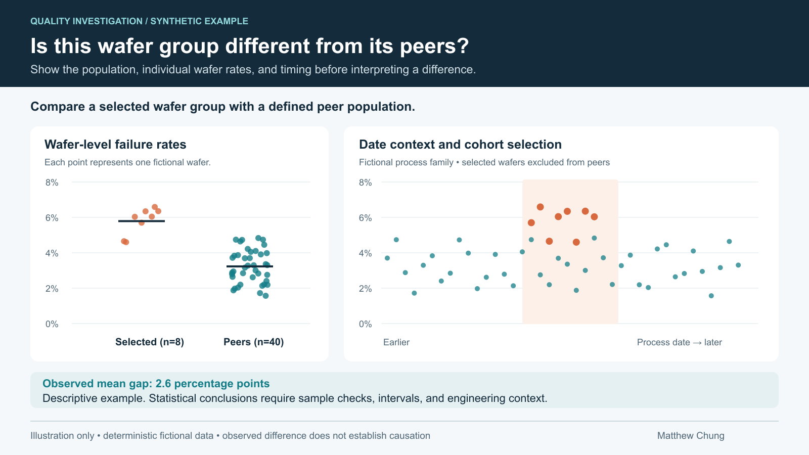
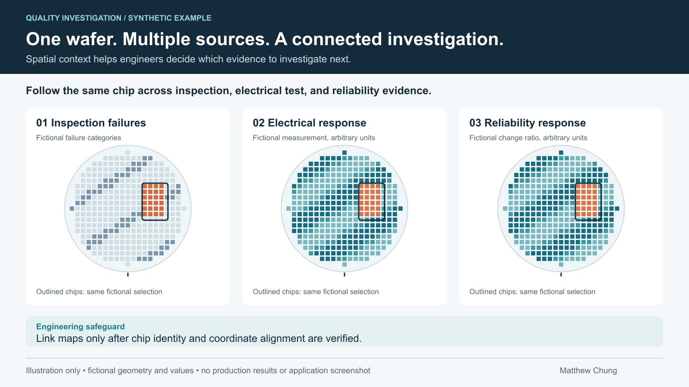

# Wafer Quality Investigation

**What I built:** Connected wafer comparison and spatial investigation tools that bring inspection, electrical test, specifications, and package reliability evidence into engineering review.

**What it demonstrates:** Quality engineering, statistical comparison, manufacturing traceability, coordinate validation, data reuse, and scientific visualization.

## Problem

A low Yield result tells an engineer where to start. The next questions are harder:
does a selected wafer group differ from comparable production, which failures explain the gap,
and do inspection and test patterns occur at the same physical chip positions?

Answering those questions requires consistent identities, explicit comparison populations,
and careful interpretation of repeated measurements and missing evidence.

## Compare the population before interpreting the difference

*Scientific illustration with fictional wafer rates. Bars show group means; shading illustrates
selected-wafer date context. This descriptive example is not an application screenshot or production result.*

The comparison workflow connects Chip Yield selections to statistical review. It reuses curated
Parquet facts through a scoped, read-only application API. Peers are selected by process family,
nearby process dates, and relevant grade or group constraints. Selected wafers are excluded from peers.

- Compare Yield, qualification outcomes, individual test parameters, or one failure code at a time.
- Show measured wafer counts and missing measurements alongside the result.
- Use Welch's test and a difference interval for numeric wafer rates; use Fisher's exact test
  and a Wilson-based difference interval for binary qualification outcomes.
- Report insufficient data or an inconclusive comparison when evidence does not support a
  directional conclusion. A nonsignificant test does not establish equivalence.
- Export the complete comparison population even when the displayed table is bounded.

Peer selection reduces obvious mismatches but does not remove every confounder. Statistical
differences guide investigation; they do not establish causation. Repeated code or parameter
comparisons also require multiplicity and dependence to be considered during engineering review.

## Follow the same physical chip across sources

*Conceptual illustration using fictional geometry, values, and selection. Colors illustrate
patterns only; they do not encode production measurements, limits, or a private interface.*

The map workflow connects electrical measurements, current inspection failures, full inspection
reports, and package-level reliability measurements spatially. Recorded grades determine the
available specification controls. Linked selections follow the same chip across verified maps.

The difficult work is establishing correspondence:

- Resolve wafer and substrate aliases without merging ambiguous devices.
- Verify chip identity, layout, coverage, and coordinate transforms before linking maps.
- Keep reports with uncertain alignment available as independent maps.
- Preserve missing positions, repeat-report identity, and raw values.
- Distinguish current active specification evaluation from historical test-time limits.
- Distinguish parameter pass percentages from overall Yield.

Initial maps load before heavier reports. Selected-wafer retrieval, bounded caches, and compressed
responses control the workload. Linked filters operate on loaded data and preserve full-population
statistics and exports.

## Result

The tools connect two investigation paths: comparison establishes whether a wafer population
warrants attention, and spatial evidence helps locate patterns for review. Reusable Yield facts
support a new workflow, while maps retain explicit identity, alignment, and retrieval contracts.

## My ownership

I implemented comparison integration, cohort selection, rate calculations, statistical presentation,
exports, map retrieval, identity and alignment validation, linked interaction, and caching.
Source records, specification approval, physical testing, and final dispositions remain with
their respective owners.

## Implementation and evidence

These workflows are supported by audited implementation, regression tests, and integration history.
The map application is documented as internally mounted. Its latest package-level extensions and
further hosting migration should be distinguished from earlier verified behavior when discussing
deployment status.

This portfolio provides illustrations and a case study. The runnable public Yield analogue is
[Manufacturing Analytics Platform](https://github.com/4sy8zwp9hz-netizen/manufacturing-analytics-platform).
The reproducible figure source is [render_quality_visuals.cjs](../tools/render_quality_visuals.cjs).

## Confidentiality

All plotted values, geometry, counts, and selection patterns are fictional. No employer code,
database objects, identifiers, operating limits, private interface, or production records are published.
