# Manufacturing Yield Platform

**What I built:** A multi-level manufacturing Yield investigation system that moves from factory-level trends to the exact wafer, inspection, and test evidence behind a result.

**What it demonstrates:** Python/SQL application architecture, manufacturing data modeling, performance optimization, targeted retrieval, caching, reliability engineering, and production delivery.

**Runnable public implementation:** [manufacturing-analytics-platform](https://github.com/4sy8zwp9hz-netizen/manufacturing-analytics-platform)

## Problem

Yield investigation spans several data grains and time scales. A factory-level trend may point to a product, operation, tool, defect family, or individual wafer, but the supporting records are not naturally shaped for interactive analysis. Querying all high-volume inspection and test detail on every page load is slow and wasteful; aggregating everything in advance removes the detail needed for root-cause work.

The application therefore had to solve two problems at once: define trustworthy manufacturing populations and make them fast enough to investigate interactively.

## How the system evolved

The first useful version was a Python application that queried source data, transformed records with pandas, and displayed interactive Plotly figures. It proved the investigation workflow and clarified the relationships between work orders, wafers, process operations, inspection/test results, Yield populations, and defect classifications.

As history and adoption grew, the same synchronous path became a bottleneck. Broad retrieval, analytical reconstruction, and browser requests were competing for the same startup and refresh path. I separated those responsibilities into source access, transformation, prepared data publication, shared cache/preload, service logic, and targeted detail retrieval. The visible investigation workflow remained comparatively stable while these backend responsibilities changed substantially.

```mermaid
flowchart LR
    V0[SQL and pandas analysis] -->|source cost| V1[Scoped retrieval]
    V1 -->|repeated work| V2[Shared snapshot and cache]
    V2 -->|uneven workloads| V3[Separate preload and targeted detail]
    V3 -->|history scale| V4[Scheduled and incremental ETL]
    V4 -->|data contract changes| V5[Version-aware rebuild]
    V5 -->|service failures| V6[Atomic last-known-good publication]
```

### Backend evolution in practice

| Constraint revealed through use | Engineering change | Resulting capability |
| --- | --- | --- |
| Manufacturing records had different identities, dates, revisions, and grains | Build explicit transformation and cohort logic | Defensible, traceable Yield populations |
| Small investigations still paid for broad source retrieval | Resolve the population first and scope parameterized reads | Less source scanning and transfer |
| Browsers repeatedly rebuilt common facts and indexes | Share completed server snapshots and reusable caches | Faster interactions without per-user reconstruction |
| Specialized inspection and test analysis delayed the common path | Separate reusable background preloads from lazy high-volume detail | Independent latency and memory decisions by workload |
| Historical reconstruction remained expensive | Materialize validated Parquet facts through scheduled ETL | Fast, reusable analytical state |
| Full rebuilds became wasteful and corrections could arrive late | Add incremental, correction-aware refresh where supported by the source grain | More efficient historical maintenance without ignoring changed records |
| Transformation behavior changed between releases | Version the prepared-data contract and rebuild incompatible caches | Safer cache invalidation and deployment |
| Refresh and polling could overlap or consume excess memory | Add synchronization, batching, polling guards, and bounded caches | More predictable production behavior |
| A source or rebuild failure could interrupt a working view | Publish only complete generations and retain the previous valid state | Fault-tolerant refresh and continued availability |

This progression is the central engineering story: the application moved from a correct interactive
analysis toward a backend that owns extraction, transformation, materialization, refresh,
compatibility, concurrency, memory, and failure behavior.

### Why the interface changed less

The table-to-drilldown workflow continued to match the engineering task, so later releases did not
need constant visual reinvention. Keeping that workflow familiar reduced user disruption while the
backend was reworked. The perceived UI improvement—faster responses, fewer blank states, fresher
shared data, and continued access during refresh failure—came primarily from architecture rather
than styling.

Application delivery evolved in parallel but is a separate responsibility. The Yield service
moved from local and packaged use into the common hosting environment while the broader platform
standardized release distribution, application mounting, health, logging, restart, and recovery.
That related progression is documented in the
[Manufacturing Application Platform](MANUFACTURING_APPLICATION_PLATFORM.md) case study.

## Architecture

The common path uses prepared facts for fast exploration. High-volume chip and Sorting detail stays behind a targeted retrieval boundary and is loaded only for the selected physical wafer or scoped investigation. Refresh builds a new generation separately, validates it, and publishes it only after the complete snapshot is ready.

## Selected engineering challenges

### Defining the real manufacturing population

The source records came from manufacturing, inspection, chip, Sorting, and qualification data with different identifiers, dates, and grains. A database row could represent a wafer event, an inspected site, a chip result, or a qualification result, so source-row count could not be treated as the Yield denominator.

I normalized identities with explicit precedence, assigned the date owned by each manufacturing stage, and built a stated population and numerator/denominator for every displayed row. Final chip Yield was formed from the complete physical-wafer cohort required by that calculation rather than from whichever rows happened to join cleanly.

**Engineering concepts:** ETL, identity normalization, explicit analytical grain, cohort definition, traceability.

### Restricting expensive investigations before retrieval

An engineer may select a small Yield population while the underlying inspection history spans a much larger dataset. Filtering only after a broad query still pays the database and transfer cost.

I first resolve the selected manufacturing population, then pass the relevant work-order/family keys into the expensive retrieval path. Detailed failure data is therefore scoped at the source or persisted-detail boundary before the application performs classification and display aggregation.

**Engineering concepts:** query scoping, set-based filtering, predicate reduction, population-scoped retrieval.

### Moving repeated work out of the click path

As the application gained history and users, opening the application or changing common filters repeatedly rebuilt data that was shared across sessions and views.

I moved common retrieval and transformation into refresh-time preparation. Completed Yield facts, trends, and frequently reused Pareto data are published once and reused across browser interactions. Callbacks select from completed state instead of rebuilding the same manufacturing population.

**Engineering concepts:** preload, caching, eager computation, precomputation, shared analytical state.

### Separating common facts from high-volume detail

The matrix, trend, and common Pareto views are used constantly, but chip-level and parameter-level detail can be much larger and is needed only after a user selects a specific wafer or population.

I separated the workloads. Common Yield facts are prepared and preloaded, specialized summaries can refresh independently, and very detailed records stay persisted until a user requests a narrow investigation.

**Engineering concepts:** eager versus lazy computation, workload separation, targeted drill-down, memory control.

### Keeping a failed refresh from becoming an outage

A source refresh can fail even when the application already has a valid analytical dataset. Replacing that dataset in place would turn a refresh problem into an application availability problem.

I changed refresh to build and validate a new prepared generation separately, then atomically switch the active reference only after success. If retrieval, validation, or publication fails, the previous complete snapshot remains active and the application exposes the stale/failed refresh state.

**Engineering concepts:** atomic publication, snapshot retention, last-known-good behavior, fault-tolerant refresh.

### Scaling delivery with adoption

The application began as an engineering tool on a workstation. Once other engineers relied on it, local copies and independent versions became part of the problem.

I moved delivery through versioned releases into a shared portal and ultimately centralized server hosting with common startup, refresh, health, and recovery behavior. The broader hosting evolution is described in the [Manufacturing Application Platform](MANUFACTURING_APPLICATION_PLATFORM.md) case study.

**Engineering concepts:** release management, client/server delivery, centralized hosting, operational ownership.

## User workflow

The public synthetic application demonstrates the same investigation pattern:

1. Start from a period-based Yield matrix with an explicit population and denominator.
2. Select a period/cell to open the exact cohort behind the result.
3. Investigate Pareto, time trend, and physical-wafer scatter views.
4. Select a wafer for targeted chip or Sorting detail.
5. Export the exact selected population with lineage preserved.
6. Continue using the last valid dataset if a refresh fails, with freshness state visible.

## Result

The mature design creates two performance paths: low-latency exploration over prepared shared facts and narrow reads for high-volume drill-down evidence. That keeps the common investigation responsive without sacrificing the detailed records needed for root-cause work.

Just as important, the application makes data correctness and service behavior explicit. Yield populations are defined rather than inferred from row counts, readers never see a partially published refresh, and a transient source failure does not erase the last valid analytical state.

## My ownership

I designed and implemented the application architecture, Python transformations, Yield population logic, cache/preload strategy, Dash/Plotly investigation workflow, targeted detail retrieval, refresh and last-known-good behavior, testing approach, public synthetic analogue, and documentation.

The manufacturing source systems, database administration, enterprise infrastructure, and physical process remain external dependencies owned by their respective teams.

## Tradeoffs

- **Prepared Parquet facts:** provide reproducible columnar snapshots and fast reads, but do not replace transactional source systems.
- **In-process cache:** is simple and effective for a single service instance; horizontal scaling would require shared cache coordination.
- **Background refresh:** protects user latency but adds lifecycle, locking, observability, and stale-data decisions.
- **Targeted persisted detail:** controls memory and bulk retrieval but adds a separate refresh and lineage contract for drill-down data.

## Explore the implementation

- [Repository overview](https://github.com/4sy8zwp9hz-netizen/manufacturing-analytics-platform#readme)
- [Architecture](https://github.com/4sy8zwp9hz-netizen/manufacturing-analytics-platform/blob/main/ARCHITECTURE.md)
- [Data flow](https://github.com/4sy8zwp9hz-netizen/manufacturing-analytics-platform/blob/main/docs/DATA_FLOW.md)
- [Yield calculation model](https://github.com/4sy8zwp9hz-netizen/manufacturing-analytics-platform/blob/main/docs/YIELD_CALCULATION_MODEL.md)
- [Engineering evolution](https://github.com/4sy8zwp9hz-netizen/manufacturing-analytics-platform/blob/main/docs/ENGINEERING_EVOLUTION.md)
- [Performance evolution](https://github.com/4sy8zwp9hz-netizen/manufacturing-analytics-platform/blob/main/docs/PERFORMANCE_EVOLUTION.md)

## Confidentiality

The public implementation uses reproducible synthetic semiconductor data and generic source boundaries. Employer source code, database objects, credentials, network details, production data, and confidential operating rules are not included.
