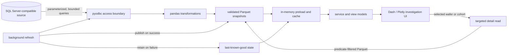
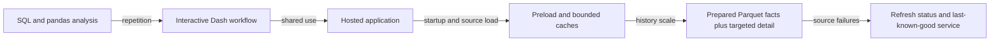

# Manufacturing Yield Platform

**Role in portfolio:** technical flagship

**Public implementation:** [manufacturing-analytics-platform](https://github.com/4sy8zwp9hz-netizen/manufacturing-analytics-platform)

**Evidence status:** runnable clean-room analogue with synthetic data

## Problem

Yield investigation spans different grains and time scales. A factory-level trend
can point to a product, operation, tool, defect family, or individual wafer, but the
supporting records are not naturally shaped for interactive analysis. Querying all
high-volume inspection detail for every page load is slow and wasteful; aggregating
everything in advance removes the detail needed for root-cause work.

The application must preserve a consistent yield denominator, expose data
freshness, remain useful during a transient source failure, and let an engineer
move from overview to evidence without changing tools.

## First solution

The initial useful shape was a Python application that queried source data,
transformed records with pandas, and displayed interactive Plotly figures. It
proved the investigation workflow and clarified the manufacturing relationships:
work order to lot, lot to wafer, wafer through operations and tools, then
inspection/test results to yield and defect classifications.

## Limitation

The same synchronous path was doing too much: retrieving broad history,
reconstructing analytical facts, and serving browser requests. Startup and refresh
cost grew with history, duplicate sessions repeated work, and source availability
was coupled to page availability.

## Iteration

The design separated source access, transformation, cache publication, service
logic, and presentation. Reusable historical facts moved to validated Parquet
snapshots. High-volume detail stayed behind a targeted on-demand query boundary.
Background preload and refresh replaced user-triggered full recomputation, while a
last-known-good snapshot kept the analytical surface available when refresh failed.

## Next problem

Caching improves latency only if readers never observe a partial publication and
if freshness is understandable. The next work was therefore operational rather
than visual: snapshot validation, atomic publication, bounded caches, explicit
health/freshness state, structured logs, and tests for calculation and cache
contracts.

## Mature state

## Evolution

The current public application is table-first. Its landing view is a period-based
Yield matrix whose rows state their population and denominator. Selecting a period
cell and choosing **Enhance** opens the exact selected population as a Pareto, a
full-range time trend, and a physical-wafer scatter. Selecting a wafer retrieves
only its chip or Sorting detail. The same investigation exposes lineage, supports
an exact-population export, and includes Sorting parameter analysis. Refresh status
and last-known-good behavior remain visible while the current screen stays usable.
All displayed records are generated from a reproducible seed; a synthetic source
adapter replaces private infrastructure without changing the analytical contracts.

## Selected Engineering Challenges

### Challenge: Raw records were not the engineering population

**What was happening**

The Yield rows came from manufacturing, inspection, chip, Sorting, and
qualification records. Those sources used different identifiers, dates, and grains.
A database row could represent a wafer event, an inspected site, a chip result, or
a qualification result; none of those row counts automatically defined the correct
Yield denominator.

**Why the earlier approach became insufficient**

Joining on whichever identifier looked similar could duplicate a physical wafer or
combine results that belonged to different populations. Applying one date rule to
every stage could also place a valid result in the wrong reporting period.

**Engineering change**

I retrieved the required source records, normalized their identities with explicit
precedence, assigned the date owned by each manufacturing stage, and built a stated
population and numerator/denominator for every displayed row. Final chip Yield was
formed only from the complete physical-wafer cohort required by that calculation.

**Why it worked**

The table stopped treating source-row count as manufacturing truth. Every result
could be traced back to the records and inclusion rules that produced it.

**Software concept**

This is ETL with identity normalization, explicit analytical grain, and cohort or
population definition.

### Challenge: A broad Pareto investigation moved too much data

**What was happening**

An engineer selected a small Yield population, but an expensive inspection/Pareto
path could retrieve far more production history than that investigation needed.

**Why the earlier approach became insufficient**

Filtering after a broad query still paid the source-query and data-transfer cost.
It also repeated work when the exact WorkOrders and wafers were already known from
the selected matrix cell.

**Engineering change**

I first resolved the selected engineering population. For the expensive inspection
path, the relevant WorkOrder/family keys were passed to the source as a set and the
detail query was restricted to those keys. Exact WorkOrder/wafer matching then
scoped prepared failure facts, while suitable failure classification and display
aggregation remained in pandas.

**Why it worked**

The expensive retrieval began with the manufacturing population the user had
actually selected instead of scanning history and discarding most of it later.

**Software concept**

This is population-scoped retrieval, query scoping, predicate reduction, and
set-based filtering.

### Challenge: Startup work leaked into repeated interactions

**What was happening**

Opening the application and changing common filters repeatedly rebuilt source and
analytical work that was shared by many users and views.

**Why the earlier approach became insufficient**

As history and adoption grew, a design that was acceptable for one engineer made
startup and click paths depend on broad retrieval and repeated transformation.

**Engineering change**

Common source populations were loaded on refresh, transformed once, published as
prepared facts, and held in memory. Frequently reused trend and Pareto views were
prepared with the snapshot, while browser callbacks filtered or selected from that
completed state.

**Why it worked**

Normal interaction no longer rebuilt the same manufacturing population. Expensive
work moved out of the user's click path and became reusable across views.

**Software concept**

This is caching, preloading, eager computation, and precomputation.

### Challenge: Not all detail belonged in the common preload

**What was happening**

The matrix, trends, and common Pareto views were reused constantly, but chip-level
and Sorting parameter detail could be much larger and was needed only after a user
selected a specific population or wafer.

**Why the earlier approach became insufficient**

Preloading every detail row would make common refresh wait for specialized,
high-volume workloads. Loading nothing would make every investigation pay the full
cost.

**Engineering change**

I separated the workloads. Common Yield facts are prepared and preloaded. Expensive
but reusable Sorting summaries run on a separate background cycle. Very detailed
chip or Sorting rows stay persisted and are read only for the selected physical
wafer or scoped investigation.

**Why it worked**

The frequent path stays responsive without sacrificing the evidence needed for a
narrow investigation, and a specialized refresh cannot block publication of the
common Yield view.

**Software concept**

This is eager-versus-lazy computation, workload separation, lazy loading, and
population-scoped retrieval.

### Challenge: Adoption changed the delivery problem

**What was happening**

The application began as a practical engineering tool. Once other engineers needed
it, running it from one workstation and coordinating local copies became part of
the problem.

**Why the earlier approach became insufficient**

A useful analysis was not a dependable shared product if users could have different
versions, separate refresh work, or no clear recovery path.

**Engineering change**

The delivery evolved through versioned releases into a common portal and a
server-hosted application with centralized preparation and refresh behavior.

**Why it worked**

Users reached one maintained application state, and operational concerns such as
startup, refresh, health, and recovery could be handled centrally. The supporting
evolution is detailed in the [Manufacturing Application Platform](MANUFACTURING_APPLICATION_PLATFORM.md)
case study.

**Software concept**

This is release management, software distribution, client/server delivery, and
centralized hosting.

### Challenge: A failed refresh could not erase a working view

**What was happening**

Source retrieval and preparation can fail even when users already have a valid
analytical dataset. Replacing that view with an error or partial data would turn a
refresh problem into an application outage.

**Why the earlier approach became insufficient**

Updating shared data in place gave readers no clean boundary between the previous
valid state and a refresh still being built.

**Engineering change**

Refresh writes a new prepared generation separately, validates its required files
and metadata, and only then changes the active reference. In memory, the completed
snapshot is replaced only after preparation succeeds. If retrieval, validation, or
publication fails, the prior valid snapshot remains active and the status reports
the failure.

**Why it worked**

Readers see either the previous complete dataset or the next complete dataset—never
a partially published refresh.

**Software concept**

This is validated atomic publication, snapshot retention, last-known-good behavior,
and fault-tolerant refresh.

## Result

The design creates two performance paths: low-latency exploration over common facts
held in memory and narrow, predicate-filtered reads from separately persisted detail
facts. The production-compatible source boundary can apply the same population
scoping before retrieval. The design also makes failure behavior explicit. A failed
refresh does not erase a valid snapshot; the UI reports freshness and continues
serving the last-known-good analytical state.

No quantified operational impact is claimed here. The demonstrated result is an
inspectable, tested architecture that addresses the latency, consistency, and
availability failure modes discovered during application evolution.

## Lessons

- Define the yield cohort and denominator before designing charts.
- Cache a stable analytical fact, not an arbitrary callback result.
- Separate broad historical summaries from high-volume drill-down retrieval.
- Treat freshness, provenance, and degraded state as product features.
- Keep source-specific SQL behind an interface so public synthetic data and
  production-compatible access exercise the same transformation contracts.
- Test manufacturing invariants and publication behavior in addition to UI paths.

## Personal ownership

| Personally designed and implemented | Existing dependency or context |
|---|---|
| Application architecture, Python transformations, cache/preload strategy, Dash/Plotly investigation workflow, refresh and last-known-good behavior, testing approach, public synthetic analogue, and documentation | Manufacturing source systems, database administration, enterprise hosting environment, and the physical manufacturing process |

## Tradeoffs

- **Parquet instead of a public SQL database:** excellent for reproducible local
  snapshots and columnar reads, but not a replacement for transactional source
  systems.
- **In-process cache:** simple and appropriate for a single service instance; a
  horizontally scaled deployment would need shared cache coordination.
- **Background refresh:** protects browser latency but adds lifecycle, locking,
  observability, and stale-data decisions.
- **Separately persisted targeted detail:** limits common memory use and bulk reads,
  but each drill-down incurs a filtered Parquet read and the detail still needs its
  own refresh and lineage contract.

## Explore the implementation

- [Repository overview](https://github.com/4sy8zwp9hz-netizen/manufacturing-analytics-platform#readme)
- [Architecture](https://github.com/4sy8zwp9hz-netizen/manufacturing-analytics-platform/blob/main/ARCHITECTURE.md)
- [Data flow](https://github.com/4sy8zwp9hz-netizen/manufacturing-analytics-platform/blob/main/docs/DATA_FLOW.md)
- [Yield calculation model](https://github.com/4sy8zwp9hz-netizen/manufacturing-analytics-platform/blob/main/docs/YIELD_CALCULATION_MODEL.md)
- [Performance evolution](https://github.com/4sy8zwp9hz-netizen/manufacturing-analytics-platform/blob/main/docs/PERFORMANCE_EVOLUTION.md)
