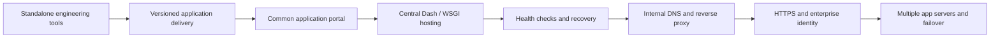
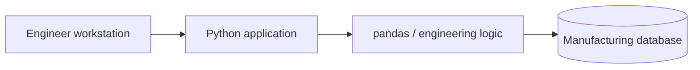
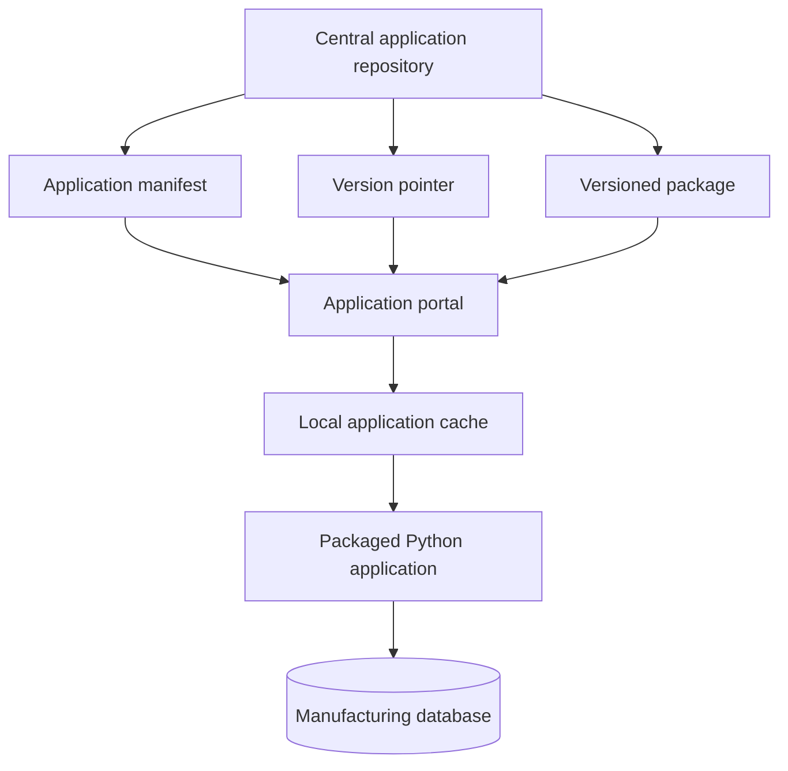
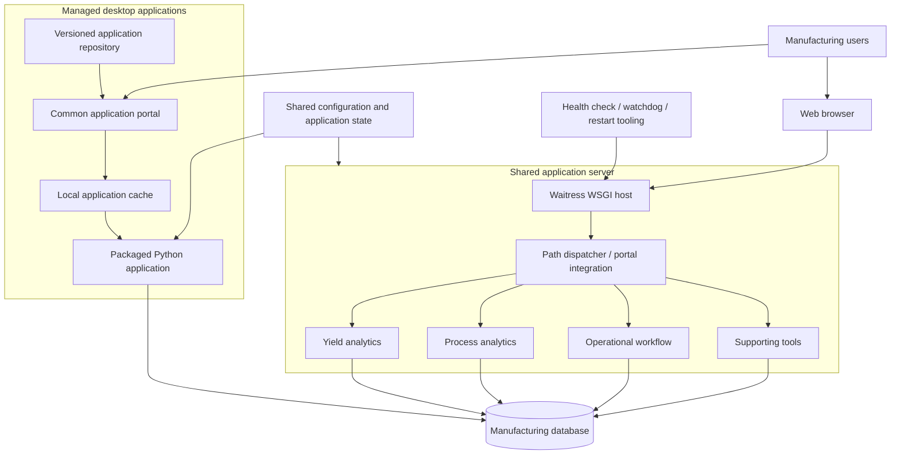
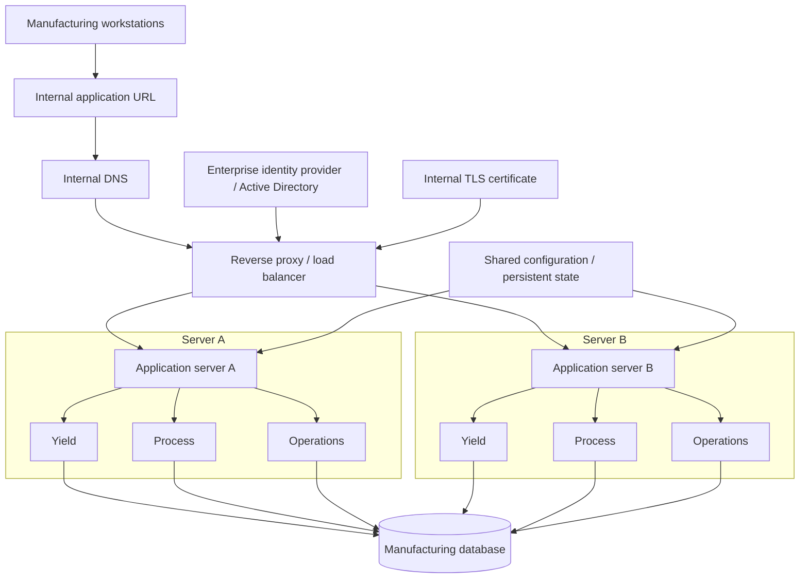
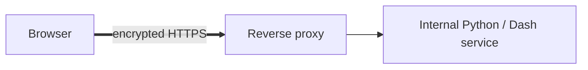
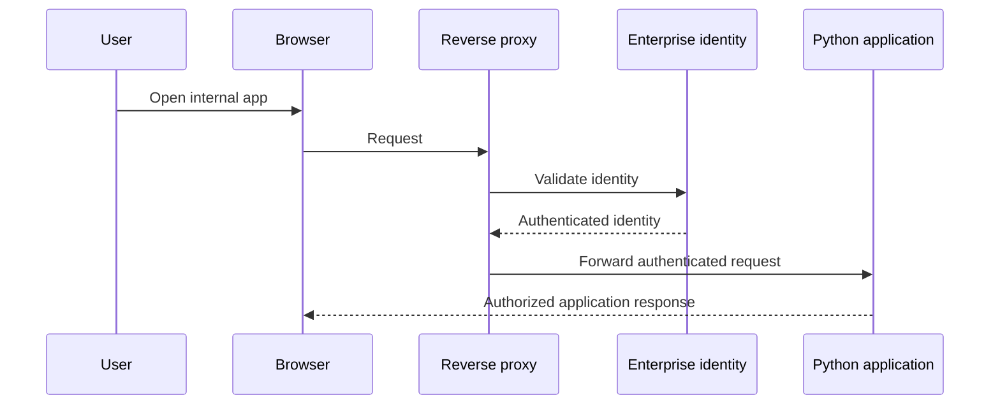
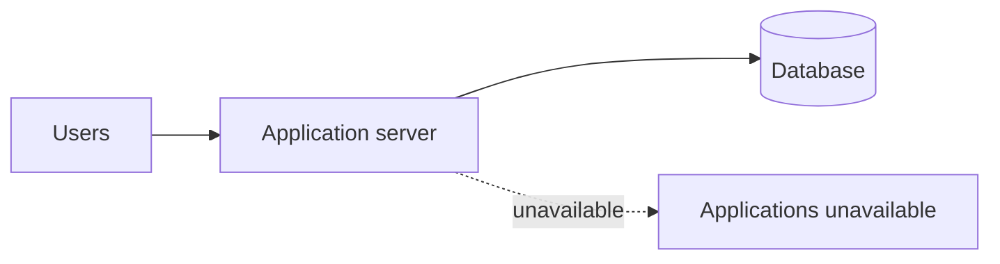
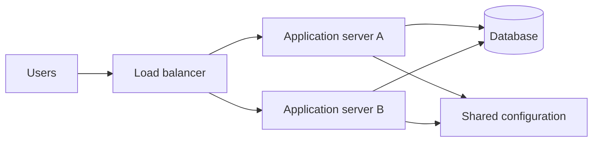

# Manufacturing Application Platform - Architecture Evolution

This document describes how the manufacturing application environment evolved from standalone engineering tools into a centrally hosted internal application platform, and the next enterprise-infrastructure step that would make the platform more resilient and easier to operate.

The diagrams are intentionally generic. Employer names, internal hostnames, network paths, database object names, credentials, and private infrastructure details are omitted.

## Architecture at a glance

The platform can be understood as three generations:

1. **Standalone engineering tools** - applications run on individual engineering workstations.
2. **Managed internal application platform** - shared delivery, a common portal, centrally hosted browser applications, shared configuration, health checks, and recovery tooling.
3. **Enterprise intranet platform** - stable internal DNS, HTTPS, enterprise authentication, reverse-proxy routing, multiple application servers, and automated failover.



The important point is that the application-development stack does not need to be replaced as the infrastructure matures. Python, pandas, Dash, Plotly, and SQL-backed domain logic can remain intact while the hosting, identity, routing, and availability layers become more enterprise-like.

---

## Generation 1 - Standalone engineering applications

The earliest tools were designed to solve specific engineering problems quickly.



Typical characteristics:

- Python executed directly on the engineer's workstation.
- Desktop UI or locally hosted Dash application.
- Direct database access from the application.
- Application-specific configuration.
- Manual or semi-manual distribution.
- Each installed copy effectively became its own deployment.

This was a productive discovery model. It kept iteration fast while the engineering requirements were still changing.

The limitation appeared when other users wanted the same tool. Copying applications created version drift, update coordination, and support overhead.

---

## Generation 2A - Managed desktop delivery

The first platform step was not central hosting. It was **repeatable software delivery**.



The portal model separates **distribution** from **execution**:

1. The portal discovers available applications.
2. It resolves the current approved version.
3. It copies the versioned package locally.
4. It extracts and launches the local executable.
5. Future launches can check whether an update is required.

This preserves the strengths of desktop applications while adding centralized release control.

### Why this mattered

- One location for application discovery.
- Repeatable installs on new computers.
- Central version ownership.
- Local execution performance.
- Reduced risk of users running stale copies from arbitrary folders.
- Documentation and application metadata can travel with the release system.

---

## Generation 2B - Current shared application platform

Applications that benefit from centralized execution can move from per-user execution to a shared server model.



This is the current architectural direction represented by the public case study.

The key changes are architectural rather than cosmetic:

- Applications can expose their WSGI servers instead of assuming they own a listener.
- A common dispatcher can mount multiple browser applications under stable paths.
- A shared Waitress host provides production-style Windows WSGI hosting.
- Health endpoints and scripted restart behavior create a defined operational contract.
- Application import failures can be isolated so one bad mount does not hide the status of healthy applications.
- Shared configuration reduces drift between application instances.

### Current architecture: strengths

- Fast Python development is preserved.
- Users receive a common entry point.
- Shared browser applications eliminate repeated per-user data processing.
- Desktop applications can still exist when local execution is the better fit.
- Application health and recovery become explicit instead of relying on a developer terminal session.

### Current architecture: remaining limitations

The current model still has infrastructure-level constraints:

- A server hostname or application-specific route is still tied closely to the hosting machine.
- A single application host can remain a single point of failure.
- Authentication and authorization are still primarily application-owned concerns.
- TLS termination, stable service naming, load distribution, and automatic failover are not yet part of the verified public architecture.

---

## Current versus target architecture

| Capability | Current platform | Target enterprise platform |
| --- | --- | --- |
| Application language | Python | Python |
| Analytical UI | Dash / Plotly | Dash / Plotly |
| Data processing | pandas / SQL | pandas / SQL |
| Desktop applications | Supported through managed packages | Retained where useful |
| Browser hosting | Central WSGI host | Central WSGI hosts behind reverse proxy |
| Application discovery | Common portal | Common portal |
| User-facing address | Host/path oriented | Stable internal service name |
| Routing | Application/dispatcher routing | Reverse proxy routing |
| Encryption | Environment dependent | HTTPS |
| Authentication | Application/local mechanisms | Enterprise identity / Windows authentication |
| Authorization | Application configuration | Enterprise groups plus application roles |
| Application servers | Primarily single shared host | Multiple equivalent hosts |
| Failure recovery | Health check and restart tooling | Health checks plus automatic failover |
| Configuration | Shared files/configuration | Shared configuration / centralized state |
| Monitoring | Application logs and health | Central health, logs, and infrastructure monitoring |

---

## Generation 3 - Target enterprise intranet architecture

The next step is to separate the **service identity** from the **physical application server**.

Users should access one stable internal address rather than knowing which machine currently runs the application.



### Stable internal DNS

Instead of teaching users a server name, port, or physical host, IT can provide a stable intranet name.

Conceptually:

```text
internal-apps.company.local
        |
        +--> reverse proxy / load balancer
```

The physical server can then change without changing the user-facing address.

### Reverse proxy

A reverse proxy such as IIS or Nginx becomes the front door for the applications.

Conceptually:

```text
/internal/yield    -> application service 1
/internal/process  -> application service 2
/internal/spc      -> application service 3
/internal/defects  -> application service 4
```

The actual backend services can continue listening on internal-only ports. Users no longer need to know those ports.

### HTTPS

The reverse proxy can terminate HTTPS using an internally trusted TLS certificate.



The Dash application itself does not need to own certificate handling.

### Enterprise authentication

Windows-integrated or enterprise identity can move authentication out of individual applications.



Applications can then focus on authorization rules such as engineer, operator, administrator, or read-only roles rather than implementing login systems independently.

### Clean failover

The current central-server model can still create a single point of failure.

#### Current



#### Target



A health check allows the infrastructure layer to determine whether a host is ready to serve requests. If one host becomes unavailable, new traffic can be sent to the healthy host.

The application design becomes failover-friendly when persistent configuration and manufacturing data are not trapped on one server's local disk.

---

## Milestone timeline

The dates below are intentionally generalized for a public portfolio. They describe the order in which the architecture matured without publishing private operational dates or internal infrastructure details.

| Approximate period | Milestone | Status |
| --- | --- | --- |
| Early 2026 | Standalone Python engineering applications used to solve focused manufacturing problems | Implemented |
| First half 2026 | Direct SQL-backed analysis evolves into reusable desktop and Dash tools | Implemented |
| Mid 2026 | Versioned local application bundles and repeatable deployment become necessary as users increase | Implemented |
| Mid 2026 | Common application portal centralizes discovery, version resolution, installation, update, and launch behavior | Implemented |
| Summer 2026 | Shared browser applications begin moving toward central server execution | Implemented |
| Summer 2026 | WSGI composition, stable mounted paths, Waitress hosting, health checks, logging, and restart/watchdog tooling mature | Implemented |
| Current public state | Hybrid model supports centrally hosted browser applications and managed desktop applications | Implemented |
| Next infrastructure phase | Stable internal DNS and reverse proxy | Planned |
| Next infrastructure phase | HTTPS with internally trusted certificate | Planned |
| Next infrastructure phase | Enterprise / Active Directory authentication and group-based access | Planned |
| Later phase | Secondary application host, health-based routing, and automatic failover | Planned |
| Later phase | Centralized infrastructure monitoring and more formal release/rollback controls | Planned |

---

## Platform maturity curve

```text
Standalone Python tools
        |
        v
Reusable SQL + pandas analysis
        |
        v
Dash and desktop engineering applications
        |
        v
Versioned application packages
        |
        v
Common application portal
        |
        v
Central application server
        |
        v
Mounted WSGI applications
        |
        v
Health checks + logs + restart/watchdog
        |
        v
Stable internal DNS                 [planned]
        |
        v
Reverse proxy + HTTPS               [planned]
        |
        v
Enterprise authentication           [planned]
        |
        v
Multiple application servers        [planned]
        |
        v
Automatic failover                  [planned]
        |
        v
Enterprise internal application platform
```

---

## Why the architecture changed

Each step was driven by a new constraint rather than by a desire to adopt more technology.

| Stage | New problem | Architectural response |
| --- | --- | --- |
| One engineer, one problem | Analysis needed to exist quickly | Python, SQL, pandas |
| Repeated use | Manual analysis no longer scaled | Dash / reusable applications |
| More users | Copies became difficult to distribute | Versioned releases and portal |
| More shared use | Every workstation repeated the same work | Central server hosting |
| Multiple browser apps | Separate ports and startup logic became fragmented | WSGI composition and common portal |
| Operational support | A running script was not enough | Health checks, logs, restart, watchdog |
| Service identity | Users should not care which server runs the app | Internal DNS and reverse proxy |
| Security | Identity should not be reinvented in every app | HTTPS and enterprise authentication |
| Availability | One server should not stop the platform | Multiple hosts and automatic failover |

This progression is the core engineering story: **the infrastructure evolved only when real usage exposed the next constraint.**

---

## Separation of responsibilities

A mature version of the platform keeps responsibilities explicit.

| Layer | Responsibility |
| --- | --- |
| Python | Manufacturing logic and application behavior |
| pandas | Data transformation and analytical preparation |
| SQL | Manufacturing source data and database-side filtering |
| Dash / Plotly | Interactive analytical user interface |
| WSGI / Waitress | Python web application execution |
| Portal / dispatcher | Application discovery and mounting |
| Reverse proxy | User-facing routing and TLS termination |
| Internal DNS | Stable service name |
| Enterprise identity | Authentication |
| Application roles | Authorization |
| Load balancer | Host selection and failover |
| Shared storage/configuration | Common persistent application state |
| Monitoring | Health, logs, resource and service visibility |

This separation is why the existing Python applications do not need to be rewritten in a different frontend framework merely to gain enterprise infrastructure characteristics.

---

## Public evidence boundary

The current repository supports the architecture through central application access, WSGI composition, Waitress hosting, shared configuration patterns, health checking, logging, and restart/recovery tooling.

The following are presented only as the **sensible next evolution**, not as completed production claims:

- IIS or Nginx reverse-proxy deployment
- stable enterprise DNS alias
- HTTPS/TLS termination
- Active Directory or other enterprise SSO
- multiple active application servers
- load-balanced automatic failover
- zero-downtime deployment
- container or Kubernetes orchestration

That distinction is deliberate. The goal of this portfolio is to explain real engineering progression without claiming infrastructure that was not part of the verified implementation.