# Manufacturing Application Platform - Architecture Evolution

This document describes how a set of manufacturing engineering tools evolved from local Python scripts into a managed internal application platform, and the next infrastructure step that would turn that platform into a more conventional enterprise intranet service.

The progression matters because the platform was not designed top-down. Each architectural step appeared only after the previous delivery model exposed a new constraint.

The diagrams are intentionally generic. Employer names, private hostnames, network paths, database object names, credentials, internal URLs, and other private infrastructure details are omitted.

## Architecture at a glance

The actual evolution is best understood as six stages:

1. **Local `.py` engineering tools** - Python scripts and applications run directly on the developer's workstation.
2. **Packaged `.exe` applications** - Python applications are frozen into user-runnable bundles so other engineers do not need a development environment.
3. **Versioned launcher distribution** - batch launchers, version pointers, and versioned network packages make upgrades repeatable.
4. **Common application portal** - one portal discovers, installs, updates, documents, and launches multiple applications.
5. **Central server hosting** - selected Dash applications move from per-user execution to centrally hosted WSGI services with shared refresh, health, logging, and recovery behavior.
6. **Enterprise intranet platform** - stable internal DNS, reverse-proxy routing, HTTPS, enterprise identity, multiple application hosts, and automatic failover become infrastructure responsibilities.

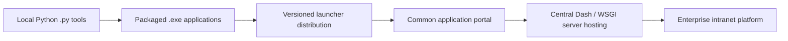

The application-development stack does not need to be discarded as the infrastructure matures. Python, pandas, Dash, Plotly, and SQL-backed manufacturing logic can remain the application layer while delivery, routing, identity, security, and availability improve around it.

---

# Stage 1 - Local Python engineering tools

The earliest applications were built to answer immediate manufacturing questions quickly.

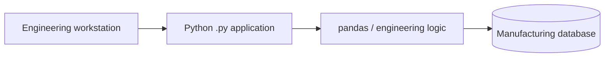

Typical characteristics:

- `.py` files run directly from an engineering workstation.
- Python and dependencies are installed on the development machine.
- Desktop UI or locally hosted Dash is appropriate because the developer is also the primary user.
- The application connects directly to manufacturing data sources.
- Configuration is application specific.
- Deployment is not yet a separate engineering problem.

### Why this was the right first architecture

At this stage the important question is whether the engineering workflow is useful, not whether the application has enterprise infrastructure.

Direct Python execution provides the shortest path between:

```text
manufacturing problem
        |
        v
SQL / process investigation
        |
        v
Python logic
        |
        v
working engineering tool
```

### What exposed the next constraint

Once other engineers wanted to use the same application, direct `.py` execution became inconvenient:

- users should not need Python installed;
- dependency versions should not vary by workstation;
- launch instructions should not require development knowledge;
- the developer should not have to reproduce an environment manually for each user.

That led to packaged applications.

---

# Stage 2 - Packaged executable applications

The next step separated **application development** from **application use**.

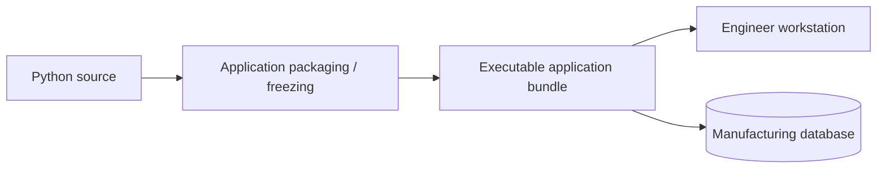

Python applications were packaged into standalone Windows application bundles, typically exposing an `.exe` entry point.

The bundle can contain the Python runtime and required libraries, allowing an engineer to launch the application without maintaining a development environment.

### What this solved

- Users no longer needed Python or IDE setup.
- The tested dependency set traveled with the release.
- Applications behaved more like normal Windows programs.
- New tools could be shared with substantially less setup knowledge.
- Desktop applications remained practical for workflows that benefit from local execution.

### What it did not solve

Packaging solves **how someone runs an application**, but not **how every installed copy stays current**.

Once several users had local application copies, a new question appeared:

> How do users reliably receive the approved version without manually copying every release?

That led to version-controlled distribution.

---

# Stage 3 - Versioned launcher and network distribution

The third stage introduced a simple internal release-management pattern.

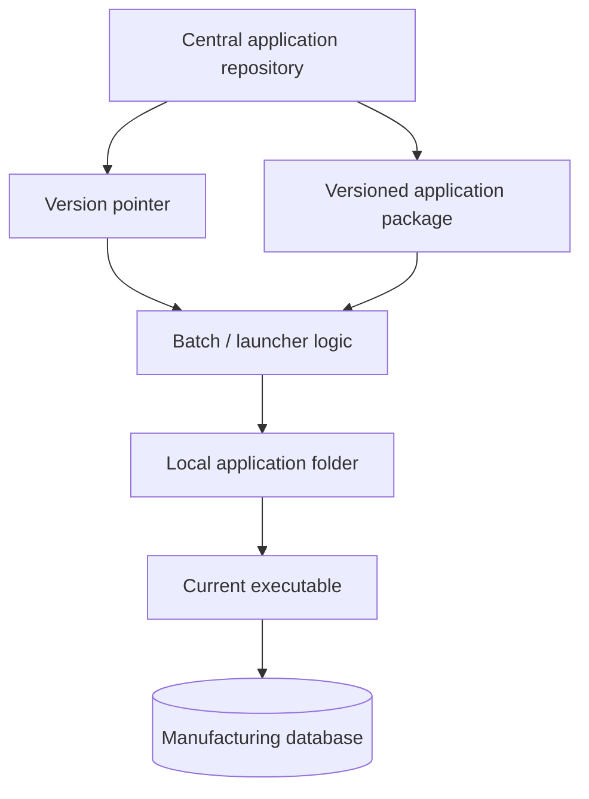

A central location owns the approved release while the application still executes locally.

A typical release flow is conceptually:

```text
latest_version.txt
        |
        v
versioned_application_package.zip
        |
        v
launcher checks current version
        |
        v
copy / extract locally
        |
        v
launch current executable
```

The specific filenames are unimportant. The architectural change is that **version resolution became centralized**.

### Why local copy rather than running from the network share

The network repository becomes the source of truth for releases, but local execution preserves:

- predictable runtime performance;
- less sensitivity to transient share latency;
- a clean separation between release storage and application execution;
- the ability to stage and validate a package before launch.

### What this solved

- Repeatable application updates.
- A single approved release pointer.
- Less manual copying of application folders.
- Clearer rollback/version history.
- Consistent launch behavior across users.

### What exposed the next constraint

As the number of applications increased, separate launchers and release locations became another discovery problem.

Users now needed to know:

- which applications existed;
- where to find each launcher;
- which tool solved which problem;
- whether an application was installed/current;
- where documentation lived.

That led to a common application portal.

---

# Stage 4 - Common application portal

The release mechanism itself became an application.

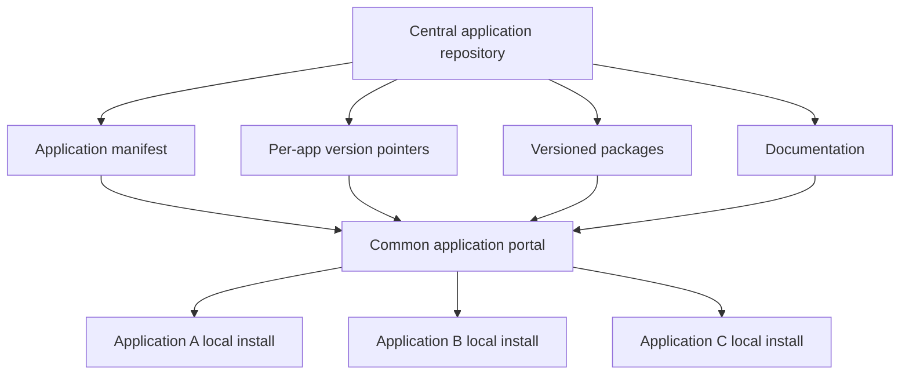

Instead of requiring one launcher per application to be discovered independently, the portal provides one common entry point.

The portal can:

1. read centralized application metadata;
2. show available applications and descriptions;
3. determine the approved package version;
4. copy and extract packages to a local application cache;
5. detect whether the current version is already installed;
6. launch the correct executable;
7. expose manuals or supporting documentation;
8. support bulk installation/update behavior.

### Architectural significance

This is the point where individual applications start becoming an **application ecosystem**.

Before the portal:

```text
App A launcher
App B launcher
App C launcher
App D launcher
```

After the portal:

```text
             Common Application Portal
              /        |        \
             /         |         \
          App A      App B      App C
```

### What this solved

- One application-discovery surface.
- Common release behavior.
- Centralized update logic.
- Consistent local installation locations.
- Documentation discovery.
- Easier onboarding of new applications.

### What exposed the next constraint

The portal improved distribution, but many analytical applications were still being copied and executed independently on each user's workstation.

For data-heavy browser applications, this created duplicated work:

```text
User A -> local app -> SQL query + calculations
User B -> local app -> same SQL query + calculations
User C -> local app -> same SQL query + calculations
```

For shared dashboards, the next logical step was to run the application once and let many users connect to it.

---

# Stage 5 - Central application server hosting

Selected Dash applications moved from **software distribution** to **software hosting**.

Instead of every user running the same analytical application locally:

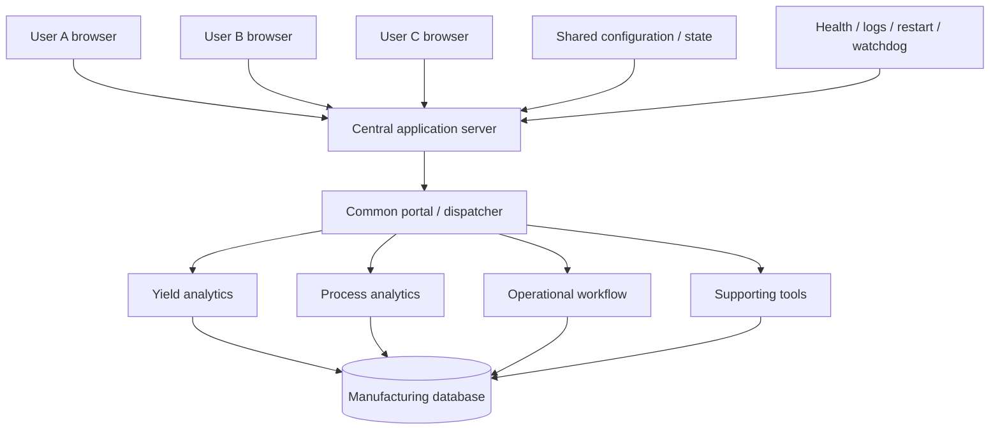

This does not eliminate desktop applications. It creates a **hybrid delivery model**:

- applications that are naturally local can still be distributed through the portal;
- shared analytical Dash applications can run centrally and be opened in a browser.

## What changed technically

Applications designed to own their own listener have to become mountable services.

The server architecture introduced patterns such as:

- exposing the underlying WSGI application;
- separating application construction from process startup;
- mounting applications under stable paths;
- managing Dash callback and asset prefixes for mounted deployment;
- using a production-style Windows WSGI host such as Waitress;
- isolating application import failures;
- central health endpoints;
- deterministic launcher/restart behavior;
- runtime logging;
- watchdog/recovery tooling;
- explicit control of background refresh services.

## Why central hosting matters

The shared server changes the cost model of common analysis.

### Distributed model

```text
20 users
   x
same SQL/query/transformation workload
   =
repeated database and CPU work
```

### Central model

```text
shared refresh / cache / prepared state
                |
                v
        many browser users
```

This can provide:

- centralized refresh cycles;
- common in-memory analytical state;
- one application upgrade instead of many local upgrades;
- fewer duplicate heavy queries;
- simpler browser access;
- common operational logging;
- clearer support ownership.

## Current architecture

The current public architecture is best represented as a hybrid platform:

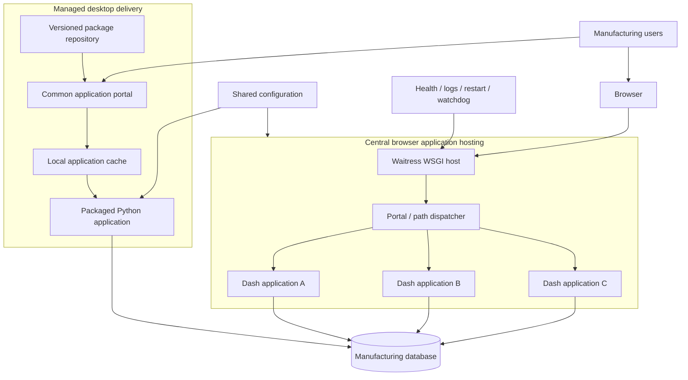

### Current strengths

- Rapid Python development is preserved.
- Desktop and browser applications can coexist.
- Users have a common discovery surface.
- Shared dashboards can centralize expensive work.
- Application releases and configuration are more controlled.
- Health and recovery become explicit operational concepts.

### Current limitations

The application layer has matured faster than the surrounding enterprise infrastructure.

Remaining limitations include:

- users can still be exposed to a physical server-oriented address;
- a single central server can remain a single point of failure;
- TLS termination is not part of the verified public architecture;
- enterprise authentication is not yet the verified application front door;
- network-level health routing and automatic failover are not yet implemented public claims.

Those constraints define the next stage.

---

# Stage 6 - Target enterprise intranet platform

The target architecture separates **the identity of the service** from **the physical machine currently serving it**.

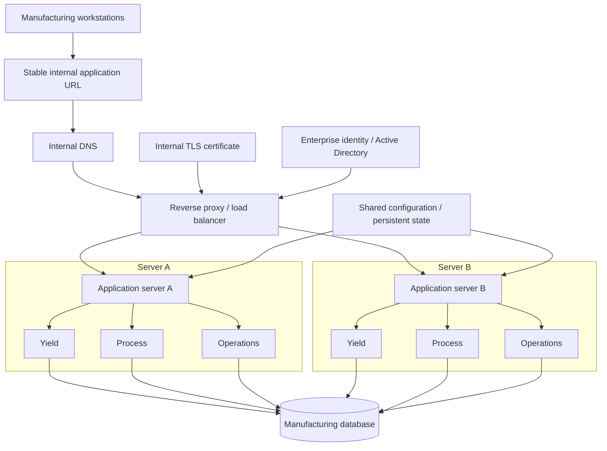

The Python/Dash application layer remains largely the same. The enterprise infrastructure is added around it.

## Stable internal DNS

Users should not need to know the physical hostname of an application server.

A stable internal DNS alias provides a permanent intranet identity:

```text
internal-apps.company.local
        |
        v
reverse proxy / load balancer
```

If the physical server changes, IT updates DNS or the routing target rather than retraining users or changing bookmarks.

## Reverse proxy

A reverse proxy such as IIS or Nginx becomes the user-facing front door.

Conceptually:

```text
/yield    -> internal Dash service
/process  -> internal Dash service
/spc      -> internal Dash service
/defects  -> internal Dash service
```

Backend applications can continue listening on internal ports. Users interact only with the stable application URL.

## HTTPS

The reverse proxy can terminate HTTPS using an internally trusted TLS certificate.

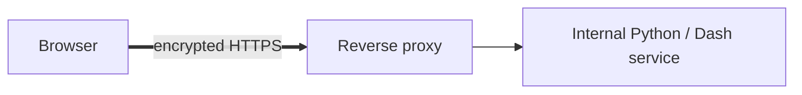

This keeps certificate management in the infrastructure layer instead of reimplementing TLS in each Dash application.

## Enterprise authentication

Windows-integrated authentication or another enterprise identity provider can move authentication out of individual applications.

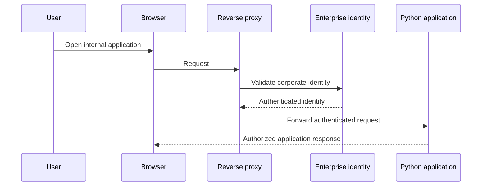

The application can then focus on role-based behavior rather than maintaining a separate login system.

Potential roles might conceptually include:

- application users;
- engineers;
- application administrators;
- read-only production users.

The exact enterprise group structure remains an infrastructure/security decision.

## Clean failover

Central hosting reduces duplicated execution, but one application server can still be a single point of failure.

### Current single-host model

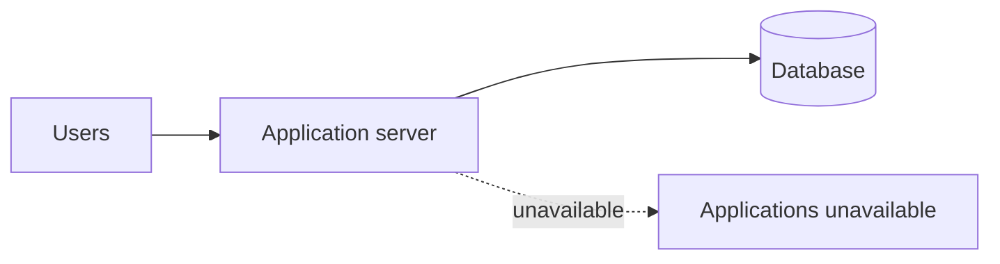

### Target multi-host model

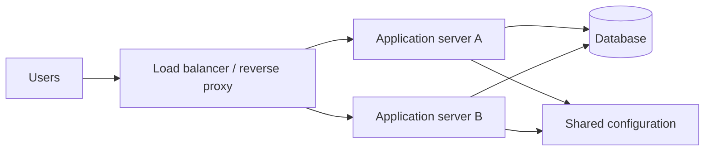

Health checks let the infrastructure layer decide whether a host is ready to receive traffic.

If one host fails:

```text
Server A: unhealthy
Server B: healthy
        |
        v
new traffic -> Server B
```

Failover becomes practical because manufacturing data and authoritative configuration are not trapped exclusively on one application's local disk.

---

# Current versus target architecture

| Capability | Current platform | Target enterprise platform |
| --- | --- | --- |
| Application language | Python | Python |
| Analytical UI | Dash / Plotly | Dash / Plotly |
| Data processing | pandas / SQL | pandas / SQL |
| Desktop applications | Versioned packaged applications | Retained where useful |
| Desktop distribution | Common portal + versioned local install | Retained where useful |
| Browser hosting | Central WSGI host | Equivalent WSGI hosts behind reverse proxy |
| Application discovery | Common portal | Common portal |
| User-facing address | Host/path oriented | Stable internal DNS name |
| Routing | WSGI dispatcher / application paths | Reverse proxy routing |
| Encryption | Environment dependent | HTTPS |
| Authentication | Application/local mechanisms | Enterprise identity / Windows authentication |
| Authorization | Application configuration | Enterprise groups + application roles |
| Shared analytical refresh | Supported by centrally hosted apps | Supported |
| Application servers | Primarily single shared host | Multiple equivalent hosts |
| Failure recovery | Health checks + scripted restart/watchdog | Health checks + automatic traffic failover |
| Configuration | Shared files/configuration | Shared configuration / persistent state |
| Monitoring | Application logs and health | Central application + infrastructure monitoring |

---

# Milestone timeline

The public portfolio intentionally uses approximate periods rather than private operational dates. The purpose is to document the sequence of engineering changes without publishing employer infrastructure history.

| Approximate period | Milestone | Status |
| --- | --- | --- |
| Early 2026 | Local `.py` engineering tools used to solve focused manufacturing problems | Implemented |
| Early-to-mid 2026 | Python applications packaged into user-runnable Windows application bundles | Implemented |
| Mid 2026 | Version pointers and versioned network packages support repeatable launcher-driven updates | Implemented |
| Mid 2026 | Common application portal centralizes discovery, installation, update, documentation, and launch behavior | Implemented |
| Summer 2026 | Selected shared Dash applications begin moving from local execution to central server hosting | Implemented |
| Summer 2026 | Mounted WSGI composition, Waitress hosting, health checks, runtime logging, restart, and watchdog behavior mature | Implemented |
| Current public state | Hybrid platform supports both centrally hosted browser applications and managed local executables | Implemented |
| Next infrastructure phase | Stable internal DNS name and reverse-proxy front door | Planned |
| Next infrastructure phase | HTTPS with an internally trusted certificate | Planned |
| Next infrastructure phase | Enterprise / Active Directory authentication and group-based access | Planned |
| Later infrastructure phase | Secondary application server and health-based routing | Planned |
| Later infrastructure phase | Automatic failover and centralized infrastructure monitoring | Planned |

---

# The architecture as a maturity curve

```text
1. Local .py engineering tools
        |
        |  Problem: other users need the application
        v
2. Packaged .exe application bundles
        |
        |  Problem: installed copies need repeatable updates
        v
3. Version pointer + network package + launcher
        |
        |  Problem: too many independent apps and launchers
        v
4. Common application portal
        |
        |  Problem: shared dashboards duplicate execution and database work
        v
5. Central Dash / WSGI application server
        |
        |  Problem: service naming, security, identity, and availability
        v
6. Enterprise intranet platform                         [planned]
        |
        +--> stable internal DNS
        +--> IIS / Nginx reverse proxy
        +--> HTTPS
        +--> enterprise authentication
        +--> multiple application hosts
        +--> health-based routing / automatic failover
```

This is the core story of the platform: **every new architecture was a response to a concrete limitation of the previous one.**

---

# Why the architecture changed

| Stage | New problem | Architectural response |
| --- | --- | --- |
| Local engineering analysis | A manufacturing question needed a fast solution | Python + SQL + pandas |
| Other engineers need the tool | Users should not maintain a Python environment | Packaged executable application |
| More installed users | Manual copying creates version drift | Versioned packages + launcher |
| More applications | Users need one discovery/update surface | Common application portal |
| More shared browser use | Per-user execution repeats the same processing | Central server hosting |
| Shared service support | A running script is not an operational contract | WSGI host + health + logs + restart/watchdog |
| Stable service identity | Users should not care which physical server runs the app | Internal DNS + reverse proxy |
| Security and identity | Login/security should not be reinvented per application | HTTPS + enterprise authentication |
| Availability | One host should not stop the platform | Multiple hosts + automatic failover |

The progression is deliberately incremental. A working manufacturing application does not need to be rewritten simply because the deployment environment becomes more sophisticated.

---

# Separation of responsibilities

A mature platform keeps the layers explicit.

| Layer | Responsibility |
| --- | --- |
| Python | Manufacturing logic and application behavior |
| pandas | Data transformation and analytical preparation |
| SQL | Manufacturing source data and database-side filtering |
| Dash / Plotly | Interactive analytical UI |
| Application packaging | Local executable distribution where required |
| Version repository | Approved release packages and version pointers |
| Application portal | Discovery, installation, updates, launch, documentation |
| WSGI / Waitress | Central Python web-application execution |
| WSGI dispatcher | Mounted application routing inside the Python service |
| Reverse proxy | User-facing routing and TLS termination |
| Internal DNS | Stable service name |
| Enterprise identity | Authentication |
| Application roles | Authorization |
| Load balancer | Host selection and failover |
| Shared configuration | Common application rules and persistent state |
| Monitoring | Health, logs, resource, and service visibility |

This separation explains why gaining enterprise infrastructure characteristics does **not** require replacing the existing Python/Dash stack with a completely different frontend architecture.

---

# Public evidence boundary

The public portfolio supports the implemented evolution through:

- local Python engineering tooling;
- packaged application delivery;
- versioned application bundles;
- centralized application metadata and portal-driven installation/update behavior;
- Dash/Plotly browser applications;
- WSGI composition and mounted application paths;
- Waitress hosting;
- shared configuration patterns;
- health checking;
- logging;
- deterministic restart/recovery tooling.

The following remain presented only as the **sensible next infrastructure evolution**, not as completed production claims:

- IIS or Nginx reverse-proxy deployment;
- stable enterprise DNS alias;
- HTTPS/TLS termination;
- Active Directory or other enterprise SSO;
- multiple active application servers;
- load-balanced automatic failover;
- zero-downtime deployment;
- container or Kubernetes orchestration.

That distinction is intentional. The portfolio documents real engineering progression while clearly separating verified implementation from proposed enterprise infrastructure.